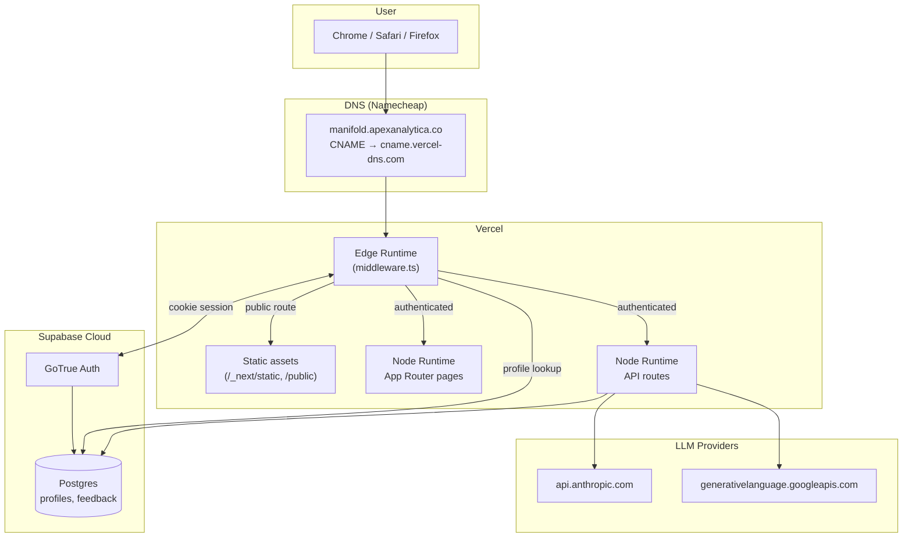
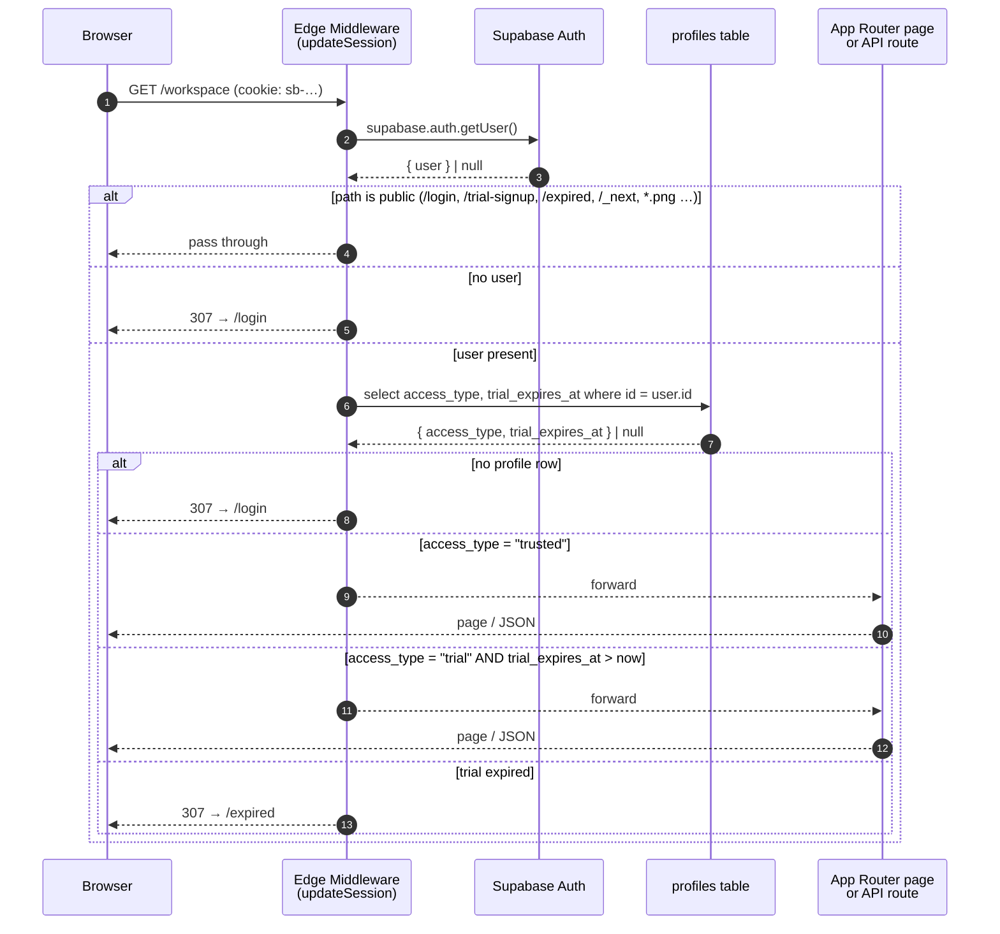
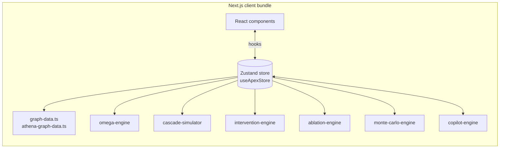
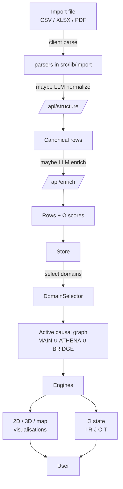
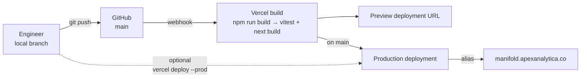

# Architecture

> **Scope:** End-to-end system topology, request lifecycle, runtime components, and the seams between them.
> **Read first:** [`README.md`](./README.md).

Manifold is a single Next.js application deployed on Vercel. Most of the analytical work happens **in the browser** — the causal-inference engines, the cascade simulator, and the intervention solver are all pure TypeScript and run client-side against state held in a Zustand store. The server side is deliberately thin: identity (Supabase), a handful of LLM-backed API routes, and a feedback sink.

This split is the most important architectural fact in the codebase. It explains:

- Why there is no application database for graph state (it lives in the browser, optionally exported to JSON snapshots).
- Why the Edge middleware is the *only* place auth is enforced.
- Why LLM-backed endpoints are stateless and idempotent — they take JSON in and return JSON out, never mutating server-side data.
- Why a Vercel cold-start is essentially free: there is no warm-up cost beyond the React bundle.

---

## 1. System topology

### Hosting summary

| Concern | Provider | Notes |
|---|---|---|
| Application hosting | **Vercel** | Project: `apex-terminal`. Production branch: `main`. |
| Custom domain | **Namecheap → Vercel DNS** | `manifold.apexanalytica.co` aliased onto the production deployment. |
| Identity / DB | **Supabase Cloud** | EU or US region (see Vercel env). One project per environment. |
| LLM inference | **Anthropic** + **Google Gemini** | Selected at runtime via `src/lib/llm-providers.ts`. |
| Source of truth | **GitHub** | `apex-terminal` repository. PRs gated on `vitest run` (see `prebuild` script). |

---

## 2. Request lifecycle

Every browser request — page or API — passes through the same Edge middleware before any application code runs. The middleware decides whether the request is public, anonymous (redirect to `/login`), trial-expired (redirect to `/expired`), or authorized.

The implementation lives in `src/lib/supabase/middleware.ts` and is wired up by `src/middleware.ts`. The matcher excludes `_next/static`, `_next/image`, `favicon.ico`, `sitemap.xml`, `robots.txt`, `logo.png`, `logo.jpg`, and `*.svg` so that static assets never pay the auth cost.

> **Why cookie-based and not bearer?** `@supabase/ssr` reads/writes auth cookies via Next's request and response objects. This lets server components and Edge middleware see the same session without any client-side bootstrap.

---

## 3. Runtime components

### 3.1 Browser (the heavy half)

Everything inside the dashed line is shipped to the browser as part of the JavaScript bundle. The Zustand store (`src/stores/useApexStore.ts`) is the single source of truth for: the active graph, selected domains, shocks, replay timeline, intervention plan, ablation set, Monte-Carlo configuration, copilot transcript, and UI focus.

Most user actions translate to `set…` calls on the store; the store recomputes derived state synchronously, and the React tree re-renders. Heavy computations (cascade, Monte-Carlo) are still synchronous but are debounced or triggered explicitly by the user (e.g. "Run forecast").

### 3.2 Server (the thin half)

| Route | Runtime | Purpose | LLM? | Writes? |
|---|---|---|---|---|
| `src/middleware.ts` | Edge | Auth gate; injects/refreshes Supabase cookies. | – | profiles read |
| `src/app/api/compute/route.ts` | Node | Deterministic causal-inference backend (graph fits, do-calculus checks). | – | – |
| `src/app/api/copilot/route.ts` | Node | LLM-powered analyst copilot. Returns structured `ACTION` commands the client executes against the store. | ✅ | – |
| `src/app/api/enrich/route.ts` | Node | LLM Omega-Fragility scoring for newly imported entities. | ✅ | – |
| `src/app/api/structure/route.ts` | Node | LLM CSV header → canonical field mapping. | ✅ | – |
| `src/app/api/feedback/route.ts` | Node | Inserts a row into `public.feedback` via service-role key. | – | feedback insert |

The server never owns analytical state. If a deployment is wiped, no analyst session is lost — the workspace lives in the browser, snapshots can be exported as JSON, and sign-in is replayed via Supabase cookies.

---

## 4. Data lifecycle

### Storage tiers

1. **In-memory (browser tab):** the live Zustand store. Fast, ephemeral, lost on tab close unless snapshotted.
2. **JSON snapshot files:** explicit user action (`src/lib/snapshots`). Round-trips the entire workspace as a single file the user downloads / re-uploads.
3. **Supabase Postgres:** identity (`auth.users`), authorization (`public.profiles`), and out-of-band feedback (`public.feedback`). **No graph data is ever written to Postgres.**
4. **LLM provider:** transient. Requests carry just enough context to answer the prompt; nothing is persisted on the provider side beyond what their retention policy specifies.

---

## 5. Deploy lifecycle

Two paths exist:

1. **Auto-deploy (preferred):** push to `main`, Vercel builds (`vitest run` runs as `prebuild`, then `next build`), and on success the new build is promoted and aliased.
2. **Manual CLI deploy:** `vercel deploy --prod` followed by `vercel alias …` to retarget the custom domain. Used when GitHub Actions or the auto-deploy is misbehaving and we need to ship out-of-band. See [`DEPLOYMENT.md`](./DEPLOYMENT.md) for the exact command sequence.

Tests are mandatory: `prebuild` runs `vitest run`, so a failing test will block both auto-deploys and CLI deploys.

---

## 6. Trust boundaries

The system has four trust boundaries; everything that crosses one is treated as untrusted until validated.

| Boundary | Crossing | Validation |
|---|---|---|
| Public internet → Vercel Edge | HTTPS request | TLS, then `updateSession` cookie check. |
| Vercel Edge → Supabase | Service call | Anon key for cookie auth; service-role key only inside `/api/feedback`. Service-role key is never sent to the browser. |
| Browser → Vercel API routes | Authenticated fetch | Same Supabase cookie; routes re-check user via `createServerClient`. |
| Vercel API routes → LLM providers | HTTPS API call | Provider API keys held in env vars only. Prompts include only fields the user uploaded; no PII enrichment. |

Per the project's safety posture, the LLM API routes will refuse to act on instructions that appear inside user-uploaded content unless those instructions are explicitly confirmed by the analyst in the chat.

---

## 7. Where to go next

- For the auth and identity story (Supabase, profiles, RLS, trial timer), read [`AUTH.md`](./AUTH.md).
- For what nodes and edges actually exist in the causal graphs, read [`DATA_MODEL.md`](./DATA_MODEL.md).
- For how the four engines and the omega/cascade/Monte-Carlo machinery work, read [`ENGINES.md`](./ENGINES.md).
- For how to ship code and recover from incidents, read [`DEPLOYMENT.md`](./DEPLOYMENT.md).
