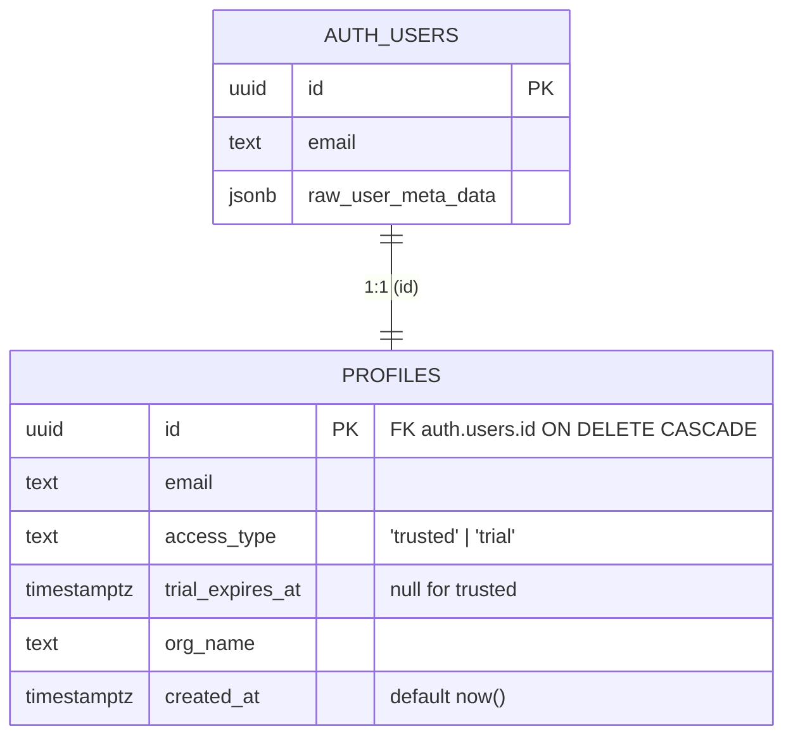
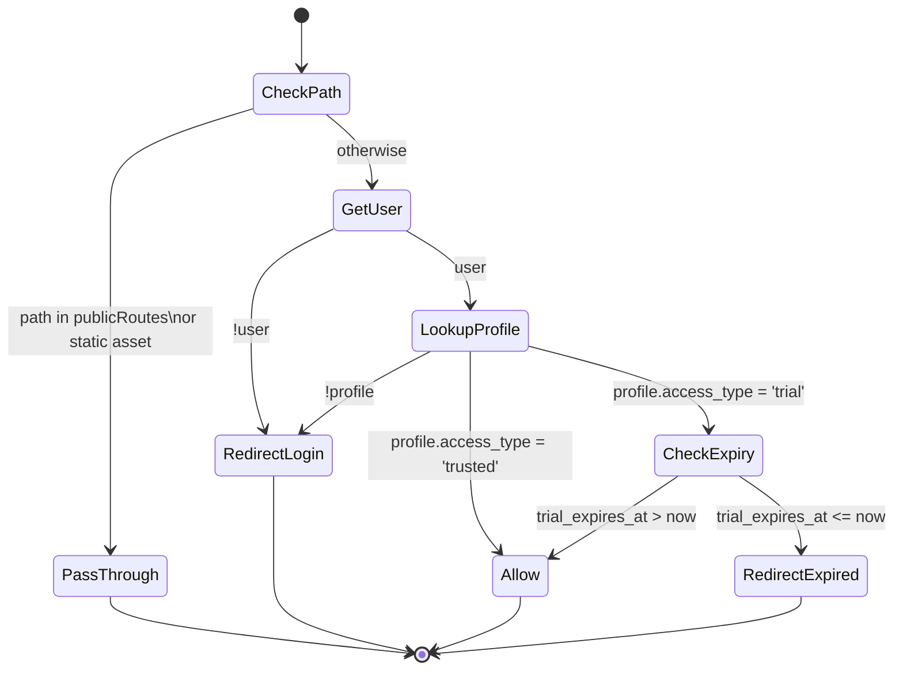

# Authentication & Authorization

> **Scope:** Identity, profiles, RLS, the trial-vs-trusted model, the Edge middleware, and the operational runbook for managing users.
> **Authoritative source:** [`supabase-setup.sql`](../supabase-setup.sql), [`src/lib/supabase/middleware.ts`](../src/lib/supabase/middleware.ts), [`src/middleware.ts`](../src/middleware.ts).

Manifold uses Supabase as its sole identity provider. Every page and API route in the application is protected by a single Edge middleware, and authorization decisions are made against a tiny `public.profiles` table that is auto-populated when a user signs up.

The model is intentionally minimal: there are exactly two access tiers (`trusted` and `trial`), trials expire after 48 hours, and admins promote users by editing one row.

---

## 1. The two-tier access model

| Tier | Created when | Expires | Notes |
|---|---|---|---|
| `trial` | Default for any new sign-up via `/trial-signup` (or any user not explicitly promoted). | 48 hours after signup. | After expiry, all authenticated requests are redirected to `/expired`. |
| `trusted` | Set manually by an admin via `update public.profiles set access_type = 'trusted'`. | Never. | Used for engineers, paying customers, design partners, and demo accounts. |

Trusted users can self-register via `/trusted-signup` using an **invite code** issued by the platform team. The invite code is validated server-side by `POST /api/trusted-signup` (service-role); the browser never learns the secret. For users who signed up as trial first, promotion is a deliberate, logged Postgres update (see §6.1).

---

## 2. Database schema



The full bootstrap script is in [`supabase-setup.sql`](../supabase-setup.sql). It is idempotent — running it twice is safe.

### Key behaviours

1. **`profiles.id`** is a foreign key onto `auth.users.id` with `ON DELETE CASCADE`. Deleting a Supabase auth user deletes the profile automatically.
2. **Row-Level Security is on.** Two policies:
   - *Users can read own profile*: `select` allowed when `auth.uid() = id`.
   - *Users can update own profile*: `update` allowed when `auth.uid() = id` (with the same `with check`).
3. **No direct insert policy.** Profiles are only ever created by the `handle_new_user()` trigger function, which runs as `security definer` and so bypasses RLS.
4. **Trigger:** `on_auth_user_created` fires `after insert on auth.users` and inserts a matching `profiles` row. The `access_type` is read from `raw_user_meta_data->>'access_type'`, defaulting to `'trial'`. For trial users, `trial_expires_at` is set to `now() + interval '48 hours'`.

> **Why a trigger and not API code?** It guarantees that *every* path that creates a Supabase user (signup form, OAuth, dashboard "Add User", or admin API call) ends up with a profile row. There is no way to forget.

---

## 3. The Edge middleware

The full code is `src/lib/supabase/middleware.ts` (≈86 lines). Conceptually:



### What counts as "public"?

```ts
const publicRoutes = ["/login", "/trial-signup", "/expired"];
const isPublic =
  publicRoutes.some((r) => pathname.startsWith(r)) ||
  pathname.startsWith("/_next") ||
  pathname.startsWith("/favicon") ||
  pathname.endsWith(".svg") ||
  pathname.endsWith(".png") ||
  pathname.endsWith(".ico");
```

Static assets are also excluded at the `matcher` level in `src/middleware.ts`:

```ts
matcher: [
  "/((?!_next/static|_next/image|favicon.ico|sitemap.xml|robots.txt|logo\\.png|logo\\.jpg|.*\\.svg).*)",
]
```

> **Why both?** The matcher saves us from running middleware at all for known static files. The runtime `isPublic` check is a defence-in-depth backup for routes the matcher does not catch (e.g. App Router static images we add later).

### Cookie handling

`@supabase/ssr`'s `createServerClient` is initialized with `cookies.getAll`/`cookies.setAll` adapters that read from `request.cookies` and write to `supabaseResponse.cookies`. This is how a refreshed session token gets back to the browser without us writing any cookie code ourselves. **Do not** replace this with bespoke `Set-Cookie` logic — it must use the SSR helper to remain in sync with refresh-token rotation.

---

## 4. Sign-in, signup, and expiry pages

| Page | File | Purpose |
|---|---|---|
| `/login` | `src/app/login/page.tsx` | Email + password sign-in via `supabase.auth.signInWithPassword`. Logo above title. Links to both signup paths. |
| `/trial-signup` | `src/app/trial-signup/page.tsx` | Self-service trial. Calls `supabase.auth.signUp` with `raw_user_meta_data.access_type = 'trial'`. |
| `/trusted-signup` | `src/app/trusted-signup/page.tsx` | Invite-code signup for trusted users. Posts to `/api/trusted-signup` (server-side, service-role), then signs in automatically. |
| `/expired` | `src/app/expired/page.tsx` | Wall shown to expired trial users. Provides a "contact us" CTA. |

All four are public routes per the middleware. They share the same logo (`/public/logo.png`) and styling.

The sign-out button lives in `HeaderBar.tsx` and calls `supabase.auth.signOut()` followed by `router.push('/login')` and `router.refresh()` to clear server-rendered state.

---

## 5. Server vs client Supabase clients

| File | Used in | Notes |
|---|---|---|
| `src/lib/supabase/client.ts` | Client components | Browser-side, picks up cookies automatically. |
| `src/lib/supabase/server.ts` | Server components, API routes | Per-request server client; reads/writes cookies via Next's `cookies()` helper. |
| `src/lib/supabase/middleware.ts` | `src/middleware.ts` only | Edge variant; bound to a `NextRequest` and a `NextResponse` for cookie pass-through. |

**Never** import the middleware client from outside `src/middleware.ts`. **Never** import the server client from a client component — Next will throw at build time.

The **service-role** key is only used in `src/app/api/feedback/route.ts`. It is read from `process.env.SUPABASE_SERVICE_ROLE_KEY` and is never bundled to the client. If you ever need a second service-role caller (e.g. for backfills), follow the same pattern: a Node-runtime API route, never a client import.

---

## 6. Operations runbook

### 6.1 Add a trusted user — invite code (preferred)

1. Share the current `TRUSTED_INVITE_CODE` with the user via a secure channel (DM, Signal, etc.).
2. Direct them to `/trusted-signup`. They enter their email, password, org, and the invite code.
3. The server-side API route validates the code, creates the user via `admin.createUser`, and sets `access_type = 'trusted'` — no manual SQL required.

To rotate the invite code: update the `TRUSTED_INVITE_CODE` env var in Vercel and redeploy. Old codes stop working immediately.

### 6.2 Promote an existing trial user to trusted

If a user already signed up via `/trial-signup`, promote them in Supabase Dashboard → SQL Editor:

```sql
update public.profiles
set access_type = 'trusted', trial_expires_at = null
where email = 'user@example.com';
```

Confirm:

```sql
select email, access_type, trial_expires_at
from public.profiles
where email = 'user@example.com';
```

> **Email case matters.** Supabase stores emails lowercased. Use `where email ilike 'User@example.com'` if unsure.

### 6.3 Pre-create a trusted user (no self-signup)

1. Supabase Dashboard → Authentication → Users → **Add user**. Set email and a temporary password.
2. The trigger creates a `profiles` row with `access_type = 'trial'` (the trigger ignores client metadata for safety; only service-role calls can set trusted).
3. Run the same `update` as 6.2 to flip them to trusted.
4. Send the temporary password via your secure channel and ask the user to rotate it on first login.

### 6.3 Extend or reset a trial

```sql
update public.profiles
set trial_expires_at = now() + interval '48 hours'
where email = 'user@example.com';
```

### 6.4 Revoke access

```sql
-- Soft revoke: keep the account, kick the session
update public.profiles
set access_type = 'trial', trial_expires_at = now() - interval '1 minute'
where email = 'user@example.com';

-- Hard revoke: delete the auth user (cascade-deletes the profile)
-- Use Supabase Dashboard → Authentication → Users → … → Delete user.
```

> **Hard deletes are destructive.** Per the project safety posture, never run `delete from auth.users …` from SQL. Always use the dashboard so the action is logged.

### 6.5 Inspect who is currently active

```sql
select email, access_type, trial_expires_at, created_at
from public.profiles
order by created_at desc;
```

### 6.6 Rotate Supabase keys

1. Supabase Dashboard → Project Settings → API → **Reset** the key being rotated.
2. Update Vercel env vars:
   - `NEXT_PUBLIC_SUPABASE_ANON_KEY` (anon)
   - `SUPABASE_SERVICE_ROLE_KEY` (service)
3. Trigger a redeploy on Vercel (env-var changes do not auto-deploy).
4. Smoke test: sign in, sign out, hit `/api/feedback`.

The `NEXT_PUBLIC_SUPABASE_URL` should not need to change unless you're moving projects entirely.

---

## 7. Common failure modes

| Symptom | Likely cause | Fix |
|---|---|---|
| Infinite redirect to `/login` | Missing `profiles` row (trigger never ran). | Verify the trigger exists; insert a profile row manually. |
| All requests to a logo or font return 307 → `/login` | Asset not in middleware exclusion list. | Add the extension/path to both the matcher and `isPublic`. |
| Users land on `/expired` immediately after signup | Trigger set `trial_expires_at` in the past (clock skew or timezone bug). | Confirm Supabase is using UTC; re-run trigger. |
| Service-role API route returns 401 | `SUPABASE_SERVICE_ROLE_KEY` env var missing in Vercel. | Re-add the env var and redeploy. |
| `/api/feedback` writes blocked by RLS | The route is using the anon client instead of service-role. | Inspect the import in `route.ts`; it must use the service-role-key constructor. |

---

## 8. What we deliberately do **not** do

- **No password resets via Manifold UI.** Users go through Supabase's built-in flow if needed.
- **No social / OAuth providers** today. Adding one is a config change in Supabase + a new button on `/login`; the middleware does not need to change.
- **No multi-factor enrollment yet.** Trusted users requiring MFA should rely on their email provider's MFA on the inbox.
- **No per-org tables.** `org_name` is a single text column on `profiles`; we will introduce a real org schema only when billing or sharing requires it.

When any of those change, this document must be updated in the same PR.
