# Billing & Tier Gating

> **Audience:** Apex Analytica engineers and operations.
> **Status:** Living document. Last refreshed 2026-05-01 (post Phase 1–4 ship — see PR #140).
> **Scope:** Every public and admin surface, API route, schema change, environment variable, and operational workflow related to institutional billing and tier-gated access on Manifold.

Manifold is sold per-seat per institution; there is no self-serve checkout. This document is the canonical reference for how that motion is wired into the application — what URLs exist, who can reach them, what they do, and what happens when a sale closes or a renewal lapses.

If you came here because:

- *You're integrating these surfaces with the marketing site* — read [§9 Marketing-site integration](#9-marketing-site-integration).
- *A customer signed up and you need to provision them* — read [§8.1 New sale closed](#81-new-sale-closed).
- *A renewal is due in 30 days* — read [§8.2 Renewal](#82-renewal).
- *A customer's payment never came* — read [§8.4 Lapsed payment](#84-lapsed-payment).

---

## 1. Customer journey, end-to-end

```mermaid
flowchart LR
  Lead[Prospect lands on<br/>manifold.apexanalytica.co/pricing] --> ContactSales{Contact sales}
  ContactSales --> Form[Submits /request-access<br/>name · email · org · use case]
  Form --> Leads[(public.leads)]
  Leads --> Admin[Admin sees row in<br/>/admin/leads]
  Admin --> Email[Admin emails<br/>via own inbox]
  Email --> Call[Discovery call]
  Call --> Trial[Admin issues 48hr trial<br/>via /admin/billing<br/>or /trial-signup]
  Trial --> Pilot[Pilot runs]
  Pilot --> Mercury[Admin creates invoice<br/>in Mercury web UI]
  Mercury --> Pay[Customer pays<br/>ACH or wire to Mercury]
  Pay --> Flip[Admin flips tier in<br/>/admin/billing<br/>+ pastes invoice id]
  Flip --> Active[Active paying customer]
  Active --> Cron[Daily pg_cron tracks<br/>period_end]
  Cron --> Renewal[T-30d: customer<br/>shows in DUE SOON]
```



There is no automated payment integration. The admin (currently Junaid) is the bridge between Mercury (where money moves) and Manifold (where access lives). This is intentional for v1 — the institutional sales motion runs at low volume and Mercury's webhook surface does not expose invoice events as of 2026-04-30 (see [`BILLING_BLOCKERS.md`](../BILLING_BLOCKERS.md) §1).

---

## 2. Public surfaces (no auth)

| URL | File | What it does |
|---|---|---|
| `/pricing` | `src/app/pricing/page.tsx` | Three tier cards (Analyst, Multi-Domain, Enterprise) with prices + features. Each CTA routes to `/request-access?tier=…`. Static rendering — no DB, no auth. |
| `/request-access` | `src/app/request-access/page.tsx` (server) + `RequestAccessForm.tsx` (client behind `<Suspense>`) | Lead capture form. Pre-fills the use-case textarea when arriving from a tier CTA. POSTs to `/api/request-access`. |
| `/expired` | `src/app/expired/page.tsx` (server) + `SignOutButton.tsx` (client) | Auth-aware upgrade wall. Loads the user's tier and copy adapts (trial vs paid lapsed vs admin-flipped expired). Primary CTA via [`UpgradeCTA`](#7-shared-components). |

The middleware allowlist for these routes lives in `src/lib/supabase/middleware.ts`:

```ts
const publicRoutes = [
  "/login", "/trial-signup", "/trusted-signup", "/api/trusted-signup",
  "/api/webhooks", "/expired", "/forgot-password", "/reset-password",
  "/auth", "/pricing", "/request-access", "/api/request-access",
];
```

---

## 3. Admin surfaces (gated by `ADMIN_EMAILS` env allowlist)

| URL | File | What it does |
|---|---|---|
| `/admin/billing` | `src/app/admin/billing/page.tsx` (server) + `BillingAdminList.tsx` (client) | Customer table sorted by `current_period_end` ASC NULLS LAST so renewals naturally float up. Filter tabs by tier, plus a **DUE SOON** view (period_end ≤ 30d, not expired). Per-row EDIT modal mutates tier / status / period dates / Mercury invoice id / seats / domain_access. Per-row EXPIRE button flips tier instantly. |
| `/admin/leads` | `src/app/admin/leads/page.tsx` (server) + `LeadsAdminList.tsx` (client) | Master-detail view of `public.leads`. Filter tabs by status (`new`, `contacted`, `trial-issued`, `closed-won`, `closed-lost`). Click a row → full use-case + notes editor + status transition buttons. The status mutation auto-stamps `contacted_at` the first time a lead leaves `new`. |
| `/admin/feedback` | (pre-existing) | Unrelated; product-feedback pipeline. |

Both new admin pages use the service-role Supabase client server-side (bypasses RLS); the middleware enforces admin-email gating before the page renders.

---

## 4. API routes

### Public

| Method · Path | File | Purpose | Auth |
|---|---|---|---|
| `POST /api/request-access` | `src/app/api/request-access/route.ts` | Inserts a row into `public.leads`. Validates name / email / org bounds (1–500 chars) and use-case (≤4000). Lower-cases email before write. | None |
| `GET /api/me/access` | `src/app/api/me/access/route.ts` | Returns the authed user's `{tier, domains, isExpired, current_period_end}`. Backs the client-side UI lock in `DomainSelector.tsx` via the [`useUserAccess`](#7-shared-components) hook. | Cookie session |

### Admin (all gated by `requireAdmin()` in `src/lib/admin-auth.ts`)

| Method · Path | File | Purpose |
|---|---|---|
| `GET /api/admin/billing/customers` | `customers/route.ts` | Paginated profile list (≤500). |
| `POST /api/admin/billing/grant-tier` | `grant-tier/route.ts` | Flexible mutation: any of `tier`, `currentPeriodStart`, `currentPeriodEnd`, `mercuryInvoiceId`, `seats`, `domainAccess`, `subscriptionStatus`. Auto-derives `subscription_status` if omitted (`active` for paid + period_end set; `none` for expired; `active` for trial/trusted). |
| `POST /api/admin/billing/expire` | `expire/route.ts` | Fast-path tier=`expired` flip on a user. |
| `POST /api/admin/leads/[id]` | `admin/leads/[id]/route.ts` | Updates lead `status` and/or `admin_notes`. Stamps `contacted_at` on first transition out of `new`. |

---

## 5. Database

### 5.1 `public.profiles` — additive changes

Migration: `supabase-billing-migration.sql` (idempotent; safe to re-run).

| Column | Type | Default | Notes |
|---|---|---|---|
| `tier` | `public.tier` enum | `'trial'` | Source of truth. Backfilled from legacy `access_type`. |
| `subscription_status` | `text` (CHECK) | NULL | One of `active`, `past_due`, `canceled`, `pending`, `none`. |
| `current_period_start` | `timestamptz` | NULL | When the current billing window opened. Backfilled from `created_at` for trials. |
| `current_period_end` | `timestamptz` | NULL | When access expires. Backfilled from `trial_expires_at` for trials. **This is what `isExpired()` reads** — `trial_expires_at` is now legacy. |
| `mercury_invoice_id` | `text` | NULL | Manual tracking. No automated sync. |
| `seats` | `integer` (NOT NULL, CHECK ≥ 1) | `1` | Reserved for multi-seat institutions. |
| `domain_access` | `text[]` | NULL | Per-customer override — see [§6 Tier model + access resolution](#6-tier-model--access-resolution). |
| `access_type` | `text` (now NULLABLE, no CHECK) | — | **Legacy.** Retained one release for deprecation cushion; readers have all moved to `tier`. |

### 5.2 `public.tier` enum

```
'trial' | 'analyst' | 'multi_domain' | 'enterprise' | 'trusted' | 'expired'
```

### 5.3 `public.tier_features` — new

Tier-default domain access list. Seeded by the migration; admin-overridable.

| Column | Type | Notes |
|---|---|---|
| `tier` | `public.tier` (PK) | One row per tier. |
| `domain_ids` | `text[]` | Default domain ids the tier unlocks. |
| `description` | `text` | Human-readable. |
| `updated_at` | `timestamptz` | |

RLS: anon + authenticated SELECT; writes are service-role only.

Default seed (post Phase 2 patch in `supabase-billing-migration.sql`):

| Tier | Domains |
|---|---|
| `trial` | All 11 public domains |
| `analyst` | `[]` — set per-customer via `profiles.domain_access` |
| `multi_domain` | All 11 public domains |
| `enterprise` | All 11 public domains (+ custom subgraphs per-customer via override) |
| `trusted` | All 11 public domains |
| `expired` | `[]` |

### 5.4 `public.leads` — new

Migration: `supabase-billing-leads.sql`.

| Column | Type | Notes |
|---|---|---|
| `id` | `uuid` (PK) | Default `gen_random_uuid()`. |
| `name` / `email` / `organization` | `text` | All required. |
| `use_case` | `text` | Optional. Up to 4000 chars (enforced in API route). |
| `source` | `text` | E.g. `request-access`, `pricing-analyst`. Lets us attribute leads to their entry surface. |
| `status` | `text` (CHECK) | `new` · `contacted` · `trial-issued` · `closed-won` · `closed-lost`. |
| `admin_notes` | `text` | Internal. |
| `contacted_at` | `timestamptz` | Auto-stamped on first transition out of `new`. |
| `created_at` | `timestamptz` | |

RLS: anon + authenticated INSERT only. Reads/updates require service-role.

### 5.5 Helper function + cron

```sql
public.expire_trial_users() returns integer
```

Flips `tier='trial'` rows whose `current_period_end` (with legacy fallback to `trial_expires_at`) has passed to `tier='expired'`, sets `subscription_status='none'`. Returns the row count.

Scheduled via `pg_cron` (`supabase-billing-cron.sql`):

```
expire-trial-users-daily  schedule=0 0 * * *  active=true
```

**Paid tiers are NOT auto-expired by cron** — intentional grace so a customer mid-renewal-conversation keeps working.

### 5.6 Migration replay order

Run in this order in the Supabase SQL Editor on a fresh project (or to bring an existing project up to current state):

1. `supabase-setup.sql` (legacy bootstrap)
2. `supabase-billing-migration.sql` (Phase 1+2)
3. `supabase-billing-leads.sql` (Phase 4)
4. Enable `pg_cron` extension via Supabase dashboard → Database → Extensions
5. `supabase-billing-cron.sql` (Phase 3 cron schedule)

All four files are idempotent.

---

## 6. Tier model + access resolution

The tier itself describes the plan; `domain_access` is the per-customer override that wins when set. Resolution logic lives in `src/lib/billing.ts`:

```ts
effectiveDomainAccess(profile, tierFeatures) =
  profile.tier === 'expired'   ? []
  : profile.domain_access ?? tierFeatures[profile.tier]
```

In English:

- **Expired** users always have `[]` regardless of override (defence in depth).
- A non-null `profile.domain_access` (even an empty `[]`) **always wins** over the tier default. This is how Analyst customers get exactly one domain.
- A null `profile.domain_access` falls back to `tier_features[tier].domain_ids`. This is how Multi-Domain / Enterprise / Trusted users get "all public domains" without admin maintenance per customer.

`isExpired(profile)` decides whether to redirect to `/expired`:

| Condition | Result |
|---|---|
| `tier === 'expired'` | expired |
| `tier === 'trusted'` | never expired |
| `current_period_end` set and ≤ now | expired |
| `tier === 'trial'` and no `current_period_end` | expired (defensive) |
| Paid tier with no `current_period_end` | not expired (admin onboarding window) |

The middleware (`src/lib/supabase/middleware.ts`) calls `isExpired()` on every authed request and redirects to `/expired` when true.

---

## 7. Shared components

| Path | What it is |
|---|---|
| `src/lib/billing.ts` | Tier types, `isExpired`, `effectiveDomainAccess`, `canAccessDomain`, `TIER_LABELS`, `PRICING_PLANS`. **No React or Supabase imports** — safe to use in edge middleware. |
| `src/lib/billing-server.ts` | `getUserAccess()` (loads profile + features, returns resolved access set), `requireDomainAccess(claimedIds)` (gate for future API routes that take explicit domain ids). Server-only. |
| `src/components/UpgradeCTA.tsx` | Client component. Primary CTA opens `NEXT_PUBLIC_SCHEDULER_URL` if set, else falls back to `mailto:` to `NEXT_PUBLIC_SALES_EMAIL` (default `info@apexanalytica.co`). Used on `/expired` and ready for `/pricing` upsell prompts. |
| `src/hooks/useUserAccess.ts` | Client hook. Module-level promise cache so repeated mounts share one fetch of `/api/me/access`. Used by `DomainSelector.tsx`. |

### Pricing copy — single source of truth

`PRICING_PLANS` in `src/lib/billing.ts` is the only place tier names, prices, and feature bullets are defined. The `/pricing` page reads from it; `/expired` and any future upsell surface should too. **Update there, not in the JSX.**

---

## 8. Operational runbooks

### 8.1 New sale closed

1. Go to **Mercury** → Invoicing → **Create invoice**. Email it to the customer with the agreed amount and net-30 terms.
2. Customer pays via ACH or wire. Mercury notifies you in Mercury's UI.
3. Open `manifold.apexanalytica.co/admin/billing`.
4. Find the customer row (search by email).
5. Click **EDIT**:
   - **Tier** → `analyst` / `multi_domain` / `enterprise`.
   - **Period start** → today (or invoice date).
   - **Period end** → +1 year (use the **+1 YEAR** button).
   - **Mercury invoice ID** → paste from Mercury.
   - **Seats** → as agreed.
   - **Domain access** → for **Analyst only**, comma-separate the single domain id they bought (e.g. `t1d-beta-cell`). For **Multi-Domain / Enterprise**, leave blank — the tier default takes over.
   - **Status** → leave blank to auto-derive `active`.
6. **Save.** They're now active.

If the customer is upgrading from a trial, the same row gets edited; their tier flips and `current_period_end` extends.

### 8.2 Renewal

T-30d before `current_period_end`, the customer appears in `/admin/billing`'s **DUE SOON** filter tab.

1. Email them via your own inbox to confirm renewal.
2. On confirmation, generate a new Mercury invoice.
3. On payment, return to `/admin/billing` → **EDIT** → click **+1 YEAR** to bump `current_period_end` → paste new invoice ID → Save.

### 8.3 Lead came in

1. `/admin/leads` shows new rows with status `new`.
2. Click a row → review their use case.
3. If qualified, transition status to `contacted` (auto-stamps `contacted_at`).
4. Email them to schedule a discovery call.
5. After the call, if they want a pilot:
   - Create a trial user via `/admin/billing` → find or create them → set tier=`trial`, period_end = today + 48h (or longer, e.g. +14d for institutional pilots).
   - Or use `/trial-signup` and have them self-onboard.
6. Transition lead status to `trial-issued`.
7. After the pilot: transition to `closed-won` (paid, see §8.1) or `closed-lost`.

### 8.4 Lapsed payment

If a paid customer's `current_period_end` passes and they haven't renewed:

- The cron does **not** auto-expire them. Their access continues.
- They appear at the top of `/admin/billing` (sorted by period_end ASC).
- Decide:
  - Grace period: leave them be while you chase the invoice.
  - Hard cutoff: click **EXPIRE** on their row. They are immediately bounced to `/expired` on next page load.

### 8.5 Comping a user (internal / partners / due-diligence reviewers)

Use the `trusted` tier — never expires, full public domain access, no Mercury invoice required. Either:

- `POST /api/trusted-signup` with the invite code (existing flow).
- Or in `/admin/billing`, EDIT an existing user → set tier=`trusted`, status=`active`, leave period dates blank.

---

## 9. Marketing-site integration

The marketing site (currently the apexanalytica.co main site, separate codebase) should link **into** these surfaces, not iframe them. Recommended patterns:

### 9.1 Direct outbound links from the marketing site

| Marketing nav item | Target |
|---|---|
| **Pricing** | `https://manifold.apexanalytica.co/pricing` |
| **Request access** / **Get a demo** | `https://manifold.apexanalytica.co/request-access` |
| **Sign in** | `https://manifold.apexanalytica.co/login` |

If you want to disambiguate the inquiry tier, append `?tier=analyst|multi_domain|enterprise` — the form pre-fills the use-case textarea and the `source` column on the lead becomes `pricing-<tier>` instead of `request-access`. Useful for attribution if you advertise different tiers from different campaign pages.

### 9.2 Subdomain rewrite (optional, future)

If you want `apexanalytica.co/pricing` and `apexanalytica.co/request-access` to serve directly without a subdomain hop, configure a Vercel rewrite on the marketing site:

```js
// vercel.json on the apexanalytica.co project
{
  "rewrites": [
    { "source": "/pricing",         "destination": "https://manifold.apexanalytica.co/pricing" },
    { "source": "/request-access",  "destination": "https://manifold.apexanalytica.co/request-access" }
  ]
}
```

Caveats:

- Cookies set by Manifold (auth session) live on `manifold.apexanalytica.co`, not the apex. Rewrites do **not** share cookies, so login/signup pages should remain on the manifold subdomain (or the user gets bounced).
- Static asset paths in the rewritten pages resolve against the apex, which can break logos and fonts. Test before shipping.

### 9.3 Embed the form (NOT recommended)

Iframing `/request-access` into the marketing site is technically possible but has cookie / CSP / styling issues. Use direct links instead. If you genuinely need the form embedded, build a small standalone version on the marketing site that POSTs to `https://manifold.apexanalytica.co/api/request-access` (the API route does its own CORS — verify before shipping).

### 9.4 Branding consistency

The Manifold pages use:

- Font: Michroma (uppercase, tracked) for display + monospace for body. Defined in `src/app/globals.css`.
- Accent color: `--accent-cyan: #00e5ff`.
- Logo: `/logo.png` (the same Manifold logo you see in the workspace).

If the marketing site uses a different visual system, the pricing / request-access pages will visibly clash. Either match the marketing site or accept the seam at the subdomain boundary.

---

## 10. Environment variables

| Name | Where used | Required? | Notes |
|---|---|---|---|
| `NEXT_PUBLIC_SUPABASE_URL` | Everywhere | yes | Pre-existing. |
| `NEXT_PUBLIC_SUPABASE_ANON_KEY` | Client + middleware | yes | Pre-existing. |
| `SUPABASE_SERVICE_ROLE_KEY` | All admin API routes, `/api/request-access` | yes | Pre-existing. Vercel flags as "Needs Attention" — cosmetic, asks you to mark it Sensitive. |
| `ADMIN_EMAILS` | Middleware + `requireAdmin` | yes | Pre-existing. Comma-separated allowlist for `/admin/*`. |
| `TRUSTED_INVITE_CODE` | `/api/trusted-signup` | yes | Pre-existing. |
| `NEXT_PUBLIC_SCHEDULER_URL` | `UpgradeCTA` | optional | Cal.com / Savvycal URL. Falls back to mailto if unset. |
| `NEXT_PUBLIC_SALES_EMAIL` | `UpgradeCTA` | optional | Defaults to `info@apexanalytica.co`. |

All `NEXT_PUBLIC_*` vars are baked at build time on Vercel — changing one requires a fresh build, not just a redeploy. Vercel does not inherit env vars between Production / Preview / Development; set in all three (see [`DEPLOYMENT.md`](./DEPLOYMENT.md) §2.2).

---

## 11. Deferred items

See [`BILLING_BLOCKERS.md`](../BILLING_BLOCKERS.md) at the repo root. Summary:

1. **Mercury invoice webhooks** — Mercury exposes only treasury events as of 2026-04-30. No `invoice.*` events. Manual flip stays. Re-evaluate when Mercury announces invoice webhooks.
2. **Renewal / new-lead email transport** — admins email customers and check `/admin/leads` manually. Adding Resend or Postmark is a small follow-up project.
3. **Server-enforced gating on engine routes** — `compute/copilot/enrich/news/structure` accept opaque graph contexts; the UI lock in `DomainSelector` is the v1 gate. Closing this requires moving graph construction server-side.
4. **`/trial-signup`** — soft-deprecated. The institutional flow is `/request-access` → admin issues. Future cleanup.

---

## 12. Files

```
supabase-billing-migration.sql       Phases 1+2 schema
supabase-billing-leads.sql           Phase 4 leads table
supabase-billing-cron.sql            Phase 3 daily expiry cron
BILLING_BLOCKERS.md                  Deferred items

src/lib/billing.ts                   Tier types + helpers + PRICING_PLANS
src/lib/billing-server.ts            getUserAccess, requireDomainAccess
src/lib/supabase/middleware.ts       Public allowlist + isExpired() gate
src/components/UpgradeCTA.tsx        Shared "Contact sales" CTA
src/hooks/useUserAccess.ts           Client hook with promise cache

src/app/pricing/page.tsx             Public 3-tier pricing
src/app/request-access/              Public lead form (Suspense-wrapped)
src/app/api/request-access/          POST handler (anon)
src/app/expired/                     Auth-aware upgrade wall
src/app/admin/billing/               Admin customer console
src/app/admin/leads/                 Admin lead pipeline
src/app/api/admin/billing/           Mutation routes
src/app/api/admin/leads/[id]/        Lead status/notes mutation
src/app/api/me/access/               GET resolved access for current user

src/lib/__tests__/billing.test.ts    12 unit tests covering isExpired,
                                     effectiveDomainAccess, canAccessDomain
```
