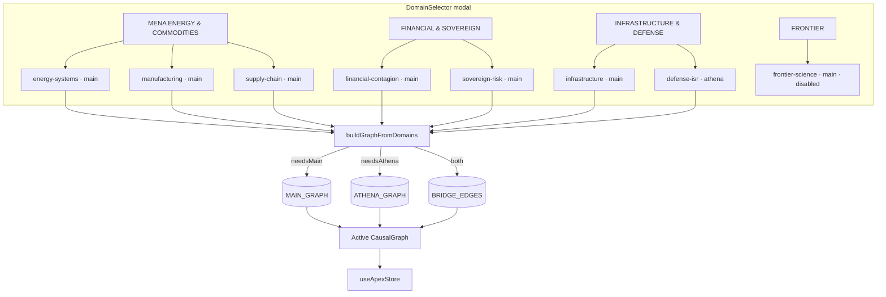

# Data Model

> **Scope:** The causal graphs that power Manifold — `MAIN_GRAPH`, `ATHENA_GRAPH`, the `BRIDGE_EDGES` that splice them together, and the domain selector that decides which subset is loaded for an analyst session.
> **Authoritative source:** [`src/lib/types.ts`](../src/lib/types.ts), [`src/lib/graph-data.ts`](../src/lib/graph-data.ts), [`src/lib/athena-graph-data.ts`](../src/lib/athena-graph-data.ts), [`src/components/DomainSelector.tsx`](../src/components/DomainSelector.tsx).

Manifold's analytical surface is a hand-curated, domain-grouped causal graph. This is *not* a database — there is no relational store of nodes and edges. The graph ships with the JavaScript bundle, lives in memory, and is composed at runtime from up to two underlying graphs (`MAIN_GRAPH` and `ATHENA_GRAPH`) plus a set of bridge edges that activate only when both graphs are loaded.

This document describes the shape of the data, what is in each graph today, and the rules for adding new nodes, edges, and domains.

---

## 1. Core types

All graph types are defined in `src/lib/types.ts`. The two that matter most:

```ts
type CausalNode = {
  id: string;                  // globally unique, snake_case
  label: string;               // human-readable
  shortLabel?: string;         // for tight layouts
  category: NodeCategory;      // 'infrastructure' | 'financial' | 'sovereign' | …
  omegaFragility: OmegaFragilityProfile; // five pillars + composite
  globalConcentration: string; // '100% Saudi Arabia' etc.
  replacementTime: string;     // '2-5 years' etc.
  physicalConstraint: string;  // narrative one-liner
  domain: string;              // logical group label (matches DomainCard.domain)
  discoverySource: 'DCD' | 'PCMCI+' | 'FCI' | 'merged' | 'manual';
  isConfounded: boolean;
  isRestricted: boolean;
};

type CausalEdge = {
  id: string;                  // '<source>__<target>'
  source: string;              // node id
  target: string;              // node id
  weight: number;              // [0,1] normalized causal strength
  lag: number;                 // discrete time-steps; 0 = contemporaneous
  type: 'directed' | 'undirected' | 'confounded' | 'bidirected';
  confidence: number;          // [0,1] from the discovery procedure
  isInconsistent: boolean;     // flagged by Tarski filter
  physicalMechanism: string;   // narrative explanation of the link
};
```

The Omega-fragility profile is the five-pillar score per node:

```ts
type OmegaFragilityProfile = {
  composite: number;           // [0,10]
  irreplaceability: number;    // I — pillar 1
  restorationLatency: number;  // R — pillar 2
  jurisdictionalHazard: number;// J — pillar 3
  cascadeLoad: number;         // C — pillar 4
  tailDepth: number;           // T — pillar 5
};
```

A graph is just `{ nodes, edges, metadata }`:

```ts
type CausalGraph = {
  nodes: CausalNode[];
  edges: CausalEdge[];
  metadata: GraphMetadata;
};
```

---

## 2. The two underlying graphs

Manifold ships with two static, hand-curated graphs. Their counts as of this commit:

| Graph | File | Nodes | Edges | Domains |
|---|---|---:|---:|---:|
| `MAIN_GRAPH` | `src/lib/graph-data.ts` | 142 | 262 | 8 |
| `ATHENA_GRAPH` | `src/lib/athena-graph-data.ts` | 18 | 28 | 1 (Defense & ISR) |
| `BRIDGE_EDGES` | `src/lib/athena-graph-data.ts` | (no nodes) | 18 | — |

> Counts are exact as of this commit; they drift slowly as edges are added in batches.

### 2.1 `MAIN_GRAPH` — civilian / economic substrate

The MAIN graph encodes Manifold's "Middle East Playbook" data collection. Its node domains are:

| Domain (`node.domain`) | Approx. node count | Theme |
|---|---:|---|
| `Saudi Aramco Energy` | 14 | East-West Pipeline, Ras Tanura/Yanbu refineries, Khurais, Abqaiq, etc. |
| `QatarEnergy LNG` | 12 | Ras Laffan, NFE/NFS expansions, LNG fleet, downstream Asia destinations. |
| `QAFCO Fertilizer` | 20 | Urea / ammonia complex, gas feedstock, freight, regional offtake. |
| `Ma'aden Phosphate` | 21 | Phosphate mining, beneficiation, Wa'ad Al Shamal, food chain transmission. |
| `Financial Contagion` | 18 | Cross-border bank exposure, credit default cascades, liquidity traps. |
| `Sovereign Risk` | 12 | EM debt restructuring, currency crises, capital flight. |
| `Supply Chain Food Security` | 10 | MENA wheat, Bunge/Almarai, freight indices, price transmission. |
| `Undersea Cable Infrastructure` | 12 | Red Sea cables, landing stations, Telecom Egypt, Orange Marine. |

A handful of intra-graph cross-domain edges (e.g. Saudi gas → QAFCO ammonia feedstock → global fertilizer price) are explicit; the rest of the cross-domain plumbing is added on demand. **An audit run during this documentation pass added 14 new cross-domain edges from the previously orphaned `ic_*` (undersea cable) nodes into supply-chain, financial-contagion, sovereign-risk, manufacturing, and food-security nodes**, so that Infrastructure no longer reads as a near-island when an analyst opens it alongside another civilian domain.

### 2.2 `ATHENA_GRAPH` — defense & ISR substrate

The ATHENA graph is a tight, 18-node, ~28-edge representation of the modern kill-chain stack:

- **SATCOM / orbital:** `leo_constellation`, `milsatcom_bw`, `ground_terminals`
- **Sensing & ISR:** ISR fusion nodes, multi-INT correlation, sensor degradation paths
- **Drone & swarm:** drone swarms, edge AI inference, swarm coordination
- **Kill chain:** target-quality / time-to-fire / weapons release nodes
- **Supply substrate:** chip embargo, secure compute, GPU allocation
- **Sovereign:** defense procurement, deterrence posture

Like the MAIN graph, ATHENA also exposes three discovery-method-filtered sub-graphs derived from `discoverySource`:

```ts
ATHENA_DCD_NODES   // discoverySource ∈ {DCD, merged}
ATHENA_DCD_EDGES   // directed edges between DCD nodes
ATHENA_PCMCI_NODES // PCMCI+ or merged + temporal-edge endpoints
ATHENA_PCMCI_EDGES // edges with lag > 0
ATHENA_FCI_NODES   // confounded or FCI
ATHENA_FCI_EDGES   // confounded type, or both endpoints in FCI nodes
```

These are what the **Trinity Panel** consumes when an analyst toggles between DCD / PCMCI+ / FCI views.

### 2.3 `BRIDGE_EDGES` — the cross-substrate splice

Bridge edges live in `src/lib/athena-graph-data.ts` and only activate when **both** MAIN and ATHENA are loaded. They are organized into five thematic clusters:

| Cluster | Example bridge | Why it exists |
|---|---|---|
| Cable ↔ SATCOM | `br_ic_red_sea__leo_constellation` | Subsea cuts push traffic onto LEO/MILSATCOM, contesting defense bandwidth. |
| Energy ↔ secure compute | Power outages cascade into chip-fab and data-center availability. |
| Maritime ↔ kill chain | Red Sea / shipping disruptions degrade ISR refresh and target-quality. |
| Sovereign ↔ defense | Fiscal stress feeds procurement freezes and deterrence erosion. |
| Chip embargo ↔ civilian comms | Defense-grade silicon constraints leak into commercial telecom buildouts. |

Each bridge has a real `physicalMechanism` string explaining the proposed channel; analysts can read these in the EdgeInspector.

> **Why activate only when both are loaded?** A bridge edge whose endpoint is missing would be a dangling edge. The merge function (`mergeGraphs`) silently drops such edges, so loading just MAIN or just ATHENA simply skips the bridges. Selecting *Infrastructure* and *Defense & ISR* together yields a fully-connected MAIN ∪ ATHENA ∪ BRIDGE graph.

---

## 3. Domain selector — what the user actually picks

Users never see "MAIN" vs "ATHENA". They see **domain cards**, grouped by theme, in the modal that opens on first launch and from the HeaderBar pill.



`DOMAIN_GROUPS` (in `DomainSelector.tsx`) is the canonical list:

| Group | Card id | `dataset` | Has data? | Description |
|---|---|---|---|---|
| MENA ENERGY & COMMODITIES | `energy-systems` | main | ✅ | Saudi Aramco / QatarEnergy LNG. |
| MENA ENERGY & COMMODITIES | `manufacturing` | main | ✅ | QAFCO / Ma'aden agrochemical. |
| MENA ENERGY & COMMODITIES | `supply-chain` | main | ✅ | MENA food security, Bunge/Almarai. |
| FINANCIAL & SOVEREIGN | `financial-contagion` | main | ✅ | Bank cascades, credit defaults. |
| FINANCIAL & SOVEREIGN | `sovereign-risk` | main | ✅ | EM debt, currency crises. |
| INFRASTRUCTURE & DEFENSE | `infrastructure` | main | ✅ | Undersea cables, landing stations. |
| INFRASTRUCTURE & DEFENSE | `defense-isr` | **athena** | ✅ | Drone swarms, SATCOM, kill chain. |
| FRONTIER | `frontier-science` | main | ❌ | Placeholder for Post-SM physics. |

`DOMAIN_CARDS` is a flat re-export consumed by `HeaderBar.tsx` to render the active-domain pill, and by Copilot tools that need to enumerate domains by id.

### Mapping card ids → graph nodes

This is where it gets subtle: `DomainCard.id` is **not** the same as `CausalNode.domain`. The card ids are short slugs (`energy-systems`, `defense-isr`); the node domains are human strings (`Saudi Aramco Energy`, `Defense & ISR`). Filtering inside the engines uses `node.domain`, not the card id.

The mapping is implicit and lives in two places:

- The text descriptions in `DOMAIN_GROUPS` (telling analysts what each card contains).
- The `domain:` field on every node in `graph-data.ts` / `athena-graph-data.ts`.

Adding a new domain therefore requires updating **both** files in the same PR.

---

## 4. Graph composition (`buildGraphFromDomains`)

The composition logic is small enough to quote (~25 lines, summarized):

```ts
export function buildGraphFromDomains(domainIds: string[]): CausalGraph {
  const selectedDomains = domainIds
    .map((id) => DOMAIN_CARDS.find((d) => d.id === id))
    .filter(Boolean) as DomainCard[];

  const needsMain   = selectedDomains.some((d) => d.dataset === "main");
  const needsAthena = selectedDomains.some((d) => d.dataset === "athena");

  let graph: CausalGraph = { nodes: [], edges: [], metadata: EMPTY_GRAPH.metadata };
  if (needsMain)   graph = mergeGraphs(graph, MAIN_GRAPH).graph;
  if (needsAthena) graph = mergeGraphs(graph, ATHENA_GRAPH).graph;
  if (needsMain && needsAthena)
    graph = mergeGraphs(graph, { nodes: [], edges: BRIDGE_EDGES }).graph;

  return graph;
}
```

`mergeGraphs` deduplicates nodes by id, deduplicates edges by `(source,target)` key, and silently discards edges whose endpoints aren't present after the merge. That last property is what makes `BRIDGE_EDGES` safe to add unconditionally — they self-prune when one substrate is missing.

---

## 5. The Zustand store as the runtime owner

Once `buildGraphFromDomains` returns, the active graph is stored on `useApexStore` (`src/stores/useApexStore.ts`). The store also holds:

- `selectedDomains: string[]` — card ids the user picked.
- `activeGraph: CausalGraph` — the merged result.
- `shocks: CausalShock[]` — applied perturbations.
- `interventionPlan` and `ablationSet` — what-if state.
- `monteCarloResult` — the most recent forecast.
- `replayActive`, `currentEpoch`, `baselineEpochs`, `interventionEpochs`, `activeTimeline` — replay buffers.
- `omegaState`, `doomsdayState`, `alertLevel` — derived but cached.
- Copilot transcript, focus, and UI flags.

The store exposes ~200 actions; the cardinal rule is: **never mutate the graph in place**. All updates go through actions that return new arrays.

---

## 6. Discovery sources & sub-graphs

Each node carries a `discoverySource` field (`DCD`, `PCMCI+`, `FCI`, `merged`, `manual`). This drives:

1. The Trinity Panel's three views (DCD / PCMCI+ / FCI) for ATHENA.
2. The Tarski filter, which can highlight edges that violate consistency constraints across discovery methods.
3. Provenance display in the EdgeInspector / NodeInspector.

`merged` means a node was confirmed by more than one discovery procedure; that's the most-trusted state.

---

## 7. Adding to the model — a checklist

When adding a new domain (large change):

1. Add a new `DomainCard` to `DOMAIN_GROUPS` in `DomainSelector.tsx`. Pick `dataset`, icon, color.
2. Add the corresponding nodes to `graph-data.ts` (or a new file if you're starting a third substrate). Set `domain` to the human label that matches your card description.
3. Add intra-domain edges with a `physicalMechanism`.
4. If the new domain should connect to an existing one, add cross-domain edges to the same edge list (no need to touch BRIDGE_EDGES unless the new substrate is its own file).
5. If you're adding an entirely new substrate (a third graph file), update `buildGraphFromDomains` and add a new `BRIDGE_EDGES_X_Y` set following the ATHENA pattern.
6. Add cascade-example strings to `CASCADE_EXAMPLES` so the modal previews are useful.
7. Run `npm test`. The graph-shape tests in `src/lib/__tests__/` will catch dangling edges and missing fields.

When adding a single node:

1. Append to `NODES` in the relevant file with all fields filled.
2. Add at least one edge connecting it to an existing node.
3. Pick a sensible `omegaFragility`. Five pillars on a 0–10 scale; the composite is your judgement, but it should be roughly the rms of the others.
4. Run tests.

When adding a single edge:

1. Use `<source>__<target>` as the id.
2. Set `weight` and `confidence` on `[0,1]`.
3. Set `lag` (0 = contemporaneous, ≥1 = temporal).
4. Always write a one-sentence `physicalMechanism`. This is the analyst-facing rationale and is non-negotiable.

---

## 8. What's deliberately *not* in the data model

- **No timestamps on nodes.** Time-series data is loaded separately at import time and joined to nodes by id (see `node-timeseries-map.ts`, `temporal-data.ts`, `real-timeseries.ts`).
- **No coordinates on nodes.** Geo coordinates live in `geo-coordinates.ts` and are joined for the map view.
- **No ownership / provenance fields per node.** Provenance is at the discovery-source level; granular provenance is captured in the imports table at runtime, not in the static graph.
- **No edge bundles or hyper-edges.** Higher-order interactions are modelled as multiple binary edges sharing a common parent.

These omissions are deliberate. The static graph is the *skeleton*; everything else is layered on at runtime by the engines, which is what [`ENGINES.md`](./ENGINES.md) covers next.
