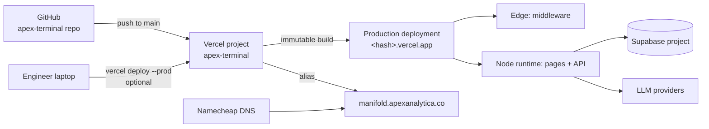
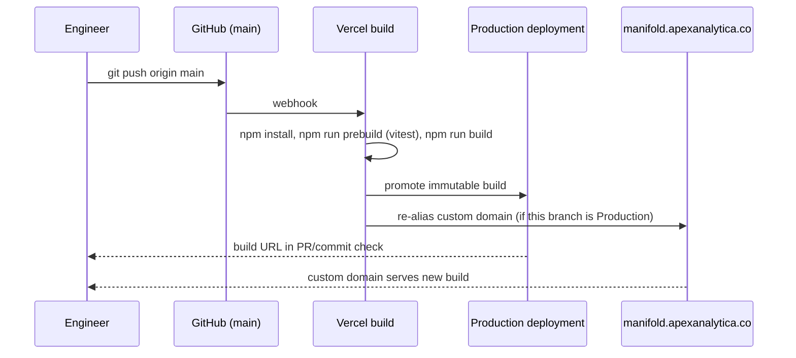

# Deployment & Operations

> **Scope:** How Manifold gets from a local branch to `manifold.apexanalytica.co`, what environment variables it needs, how the custom domain is wired, and how to recover when something goes wrong.
> **Authoritative source:** `src/middleware.ts`, `src/lib/supabase/*`, `src/app/api/*/route.ts`, `package.json`, and the Vercel project settings for `apex-terminal`.

Manifold deploys as a single Next.js application on Vercel. There is no separate backend, no worker pool, and no container image to manage. A deploy is conceptually: "push to `main`, Vercel runs `vitest run && next build`, a new immutable build is promoted, and the custom domain alias is flipped."

That simplicity is worth protecting. Most of this document is about the guardrails around that core path: env vars, alias-vs-branch-deploy conflicts, and a runbook for the failure modes we have already hit.

---

## 1. Hosting layout



| Component | Where it lives | Who owns it |
|---|---|---|
| App hosting | Vercel project `apex-terminal` | Platform |
| Source | GitHub `apex-terminal` repo, branch `main` | Engineering |
| Identity & DB | Supabase Cloud project | Platform |
| DNS | Namecheap zone `apexanalytica.co` | Platform |
| Custom domain | `manifold.apexanalytica.co` → Vercel | Platform |
| LLM keys | Vercel env vars | Engineering |

---

## 2. Environment variables

The application expects the following variables. Every single one must be set in Vercel for each environment (Production, Preview, Development); missing values fail loudly on the first request.

| Name | Exposed to browser? | Used by | Purpose |
|---|---|---|---|
| `NEXT_PUBLIC_SUPABASE_URL` | ✅ | `src/lib/supabase/*` | Supabase project URL (e.g. `https://xxx.supabase.co`). |
| `NEXT_PUBLIC_SUPABASE_ANON_KEY` | ✅ | `src/lib/supabase/*` | Anon/public key for cookie-based auth. Safe to ship to the browser because of RLS. |
| `SUPABASE_SERVICE_ROLE_KEY` | ❌ | `src/app/api/feedback/route.ts` | Service-role key for the feedback writer. **Never** prefix with `NEXT_PUBLIC_` — service role bypasses RLS and must stay server-only. |
| `GEMINI_API_KEY` | ❌ | `src/app/api/copilot/route.ts` (+ enrich/structure) | Google Gemini provider key. |
| `ANTHROPIC_API_KEY` | ❌ | same | Anthropic provider key. Either provider can be the active one. |
| `EIA_API_KEY` | ❌ | `src/app/api/feeds/eia/hormuz/route.ts` | US EIA v2 key for Persian Gulf crude production feed (Tarski A-04 chokepoint axiom). Optional: when unset, the route serves deterministic mock data tagged `(mock)` in its `source` field. Register at https://www.eia.gov/opendata/register.php. |
| `OFAC_SDN_URL` | ❌ | `src/app/api/feeds/ofac/sdn/route.ts` | Override for the upstream OFAC SDN.csv URL (default: Treasury's canonical pipe-delimited file). Optional: no key needed because OFAC publishes the list publicly. When the upstream is unreachable, the route returns deterministic mock data tagged `(mock)` so the engine path still exercises. Drives R-01 (Jurisdictional Concentration) and R-02 (Force Majeure Exposure). |
| `FRED_API_KEY` | ❌ | `src/app/api/feeds/fred/series/route.ts` | Free Federal Reserve Economic Data API key (instant registration at https://fred.stlouisfed.org/docs/api/api_key.html). Drives 18 macro/financial nodes (Fed Funds, CPI, Unemployment, JOLTS, mortgage rates, Case-Shiller, etc.). When unset, the route returns deterministic mock data per series tagged `(mock — FRED_API_KEY unset)`. |

### 2.1 Local development

`.env.local` at the repo root holds the same variables for `npm run dev`. This file is gitignored. To bring a new engineer up, the platform team copies the current Production values via the Vercel dashboard and pastes them into `.env.local` on the new laptop. `EIA_API_KEY` is the only optional entry — the EIA-fed feeds fall back to mock data when it is unset.

### 2.2 Scoping rules

- `NEXT_PUBLIC_*` variables are embedded at build time. Changing one requires a **new deploy**; a redeploy of an existing build will not pick up a new value.
- Non-public variables are read at runtime by the Node runtime routes. Changing one still requires a redeploy, because Vercel environments are immutable per build.
- The Edge runtime has a slightly smaller env-var surface than Node; if you add a new variable, prefer to read it in a Node route and pass the decision to the Edge via a header/query, rather than reading it from Edge directly.

### 2.3 Rotating a key

1. Rotate at the provider (Supabase dashboard, Google Cloud console, Anthropic console).
2. Update the matching Vercel env var in **all three** environments (Production, Preview, Development).
3. Trigger a redeploy (a no-op commit or the "Redeploy" button on the latest Production deployment).
4. Smoke test: sign in, hit `/api/feedback`, send a copilot message.
5. Revoke the old key at the provider once smoke tests pass.

---

## 3. Build pipeline

`package.json` defines the pipeline:

```json
"scripts": {
  "dev":          "next dev",
  "build":        "next build",
  "prebuild":     "vitest run",
  "start":        "next start",
  "lint":         "eslint",
  "test":         "vitest run",
  "test:watch":   "vitest",
  "test:coverage":"vitest run --coverage"
}
```

Two facts worth stating explicitly:

1. **`prebuild` runs `vitest run` before every build.** A failing test blocks *both* the GitHub auto-deploy and a manual `vercel deploy`. This is intentional — it is our only quality gate, so it runs everywhere.
2. **There is no separate lint step in the pipeline.** `eslint` is run manually or in the IDE. If we want to block on lint, add it to `prebuild`.

Node version: the project requires **Node 20+**. On macOS, use nvm and ensure `$HOME/.nvm/versions/node/v20.x.x/bin` is on `PATH` before running `npm run build` or `npx next build`. A stale Node 8 on `PATH` produces misleading "Unexpected token import" errors.

---

## 4. The two deploy paths

### 4.1 Auto-deploy from `main` (preferred)



This is the normal path. Vercel's GitHub integration watches `main`, builds on each push, and promotes the result to Production. If the build fails (tests or compilation), the old Production deployment keeps serving — rollback is automatic.

### 4.2 Manual CLI deploy (break-glass)

Used when auto-deploy is misbehaving (webhook delay, build cache corruption, GitHub integration disconnected) or when we need to ship from a non-`main` commit quickly.

```bash
# From the repo root, on the commit you want to ship:
vercel deploy --prod

# Copy the deployment URL that prints, then re-alias the custom domain:
vercel alias set <deployment-url> manifold.apexanalytica.co
```

The alias step is required because `vercel deploy --prod` promotes the new build to the project's default production URL but does **not** automatically move custom-domain aliases when there is an active GitHub integration. If you skip the alias step, the custom domain will continue serving the previous Production build.

> **Caveat:** if the GitHub auto-deploy later pushes a newer Production build, it will re-alias `manifold.apexanalytica.co` to that new build. Your manual CLI deploy only persists until the next `main` push. Don't use manual deploys as a substitute for landing a fix on `main`.

---

## 5. Custom domain wiring

`manifold.apexanalytica.co` is a subdomain of a Namecheap-managed zone, pointed at Vercel via a `CNAME`:

```
Name:   manifold
Type:   CNAME
Value:  cname.vercel-dns.com
TTL:    Automatic
```

On the Vercel side, `manifold.apexanalytica.co` is added to the `apex-terminal` project under Settings → Domains, assigned to the Production environment, and verified via the CNAME above. Vercel provisions a TLS certificate automatically.

If the certificate ever shows as "Pending" for more than a few minutes, the usual cause is a DNS record conflict (an old A record still present, or the CNAME pointing at the wrong target). Fix the DNS record and click "Refresh" in the Vercel domains panel.

---

## 6. Supabase setup (one-time)

Per-project bootstrap is in [`supabase-setup.sql`](../supabase-setup.sql) and documented in [`AUTH.md`](./AUTH.md). The short version:

1. Create the Supabase project (region closest to most users).
2. In the SQL editor, run `supabase-setup.sql` (idempotent).
3. Copy the project URL, anon key, and service-role key into the matching Vercel env vars.
4. Add any trusted users via the `update public.profiles …` pattern in `AUTH.md`.

A new environment (e.g. a staging Supabase project) is created the same way; point Vercel Preview env vars at the staging project and Production at the prod project.

---

## 7. Runbook

### 7.1 Production 500s on every request

1. Open the latest deployment in Vercel and check the Functions logs.
2. Most common cause: a missing or renamed env var. Confirm all five variables (§2) are present in **Production**.
3. Second most common cause: Supabase project paused due to inactivity (on free tier). Open the Supabase dashboard and resume.
4. If logs show `fetch failed` against an LLM endpoint, the provider is down — the `/api/copilot` route is the only path that will fail; the rest of the app should stay up. Switch `llm-providers.ts` preference if needed.

### 7.2 Sign-in redirects in an infinite loop

1. Verify `NEXT_PUBLIC_SUPABASE_URL` and `NEXT_PUBLIC_SUPABASE_ANON_KEY` match the *current* Supabase project. A stale URL will authenticate the user against a non-existent `profiles` table and bounce to `/login`.
2. In the Supabase SQL editor, confirm `profiles` has a row for the user:
   ```sql
   select id, email, access_type, trial_expires_at
   from public.profiles
   where email = '<user email>';
   ```
3. If the row is missing, the `handle_new_user` trigger failed. Re-run `supabase-setup.sql` (it is idempotent) and insert the missing row manually.

### 7.3 `manifold.apexanalytica.co` serves a stale build

1. In Vercel → Deployments, find the latest build and confirm its status is *Ready — Production*.
2. In Vercel → Settings → Domains, confirm `manifold.apexanalytica.co` is assigned to Production.
3. If you did a recent CLI deploy, the alias may be pointing at that deployment. Re-alias:
   ```bash
   vercel alias set <latest-prod-url> manifold.apexanalytica.co
   ```
4. Purge any edge caches if applicable (a no-op commit + push is the simplest way to force a cache bust).

### 7.4 A CLI deploy succeeds but nothing serves

Symptom: `vercel deploy --prod` prints a URL, that URL works, but `manifold.apexanalytica.co` still shows the old build.

Cause: the alias is still pointing at the previous Production build (usually because a GitHub auto-deploy raced you).

Fix: re-run the `vercel alias set …` line. If auto-deploys keep racing, merge your fix into `main` and let the normal path take over.

### 7.5 Pre-commit hook / push failure

If `git push` fails due to a stale GitHub credential helper, **do not** modify `git config` globally. Per the project's safety rules, retrieve the PAT from the macOS keychain and use it inline with `git -c credential.helper=…`. See the earlier session notes in `.claude/projects/...` for the exact invocation. Never commit a PAT to the repo.

### 7.6 `prebuild` fails the deploy

`vitest run` is gating every build. If tests start failing on Vercel but pass locally:

1. Reproduce with `CI=1 npm run build` locally to match the Vercel environment.
2. Check Node version (must be 20+).
3. Check that `.env.local` does not accidentally mask a real bug (tests should not depend on env vars; if one does, add it to Vercel's env config).
4. Never use `--no-verify` or disable the `prebuild` script to force a ship. Fix the test.

### 7.7 Supabase key rotation (emergency)

If a service-role key leaks:

1. Supabase Dashboard → Settings → API → Reset `service_role` key.
2. Update `SUPABASE_SERVICE_ROLE_KEY` in Vercel Production (and Preview if the same project is in use there).
3. Redeploy. The `/api/feedback` route will 401 until the new key is live — that is expected.
4. Audit `public.feedback` for rows written during the exposure window; triage as needed.
5. File an incident note.

---

## 8. Release checklist (for anything non-trivial)

Use this for changes that touch auth, the graph model, or the deploy pipeline.

- [ ] Tests pass locally (`npm run test`) and the build completes (`npm run build`).
- [ ] `.env.local` values match Production (verify via `vercel env pull`).
- [ ] Relevant docs in this folder are updated in the same PR (especially `DATA_MODEL.md` for graph changes, `AUTH.md` for identity changes).
- [ ] Preview deployment smoke-tested (sign in, open dashboard, apply a shock, run a cascade, open Copilot).
- [ ] PR description links the preview URL and lists any env-var additions.
- [ ] After merge, watch the Production deploy and re-smoke-test.
- [ ] If env vars were added, note them in the PR so future deployers know to set them.

---

## 9. What we deliberately do **not** do

- **No infrastructure-as-code for Vercel or Supabase today.** Both are managed via dashboards and occasional CLI calls. When we outgrow this, move to Terraform or Pulumi; do not reinvent the wheel in shell scripts.
- **No staging environment** distinct from Preview deployments. Every PR gets its own Preview URL; we treat the most recent Preview as staging when we need one.
- **No synthetic monitoring yet.** The cheapest first step when we need one is a Vercel-hosted cron that pings `/api/compute` and `/login` and alerts on non-200.
- **No CDN in front of Vercel.** Vercel's own edge network is the CDN. Adding another one (Cloudflare, Fastly) would break the Edge middleware guarantees without a clear benefit.

Update this section when any of these change.

---

## 10. See also

- [`README.md`](./README.md) — document map and product summary.
- [`ARCHITECTURE.md`](./ARCHITECTURE.md) — request and data lifecycle diagrams.
- [`AUTH.md`](./AUTH.md) — Supabase schema, RLS, user runbook.
- [`DATA_MODEL.md`](./DATA_MODEL.md) — MAIN_GRAPH, ATHENA_GRAPH, BRIDGE_EDGES.
- [`ENGINES.md`](./ENGINES.md) — Omega, cascade, intervention, ablation, Monte-Carlo, copilot.
