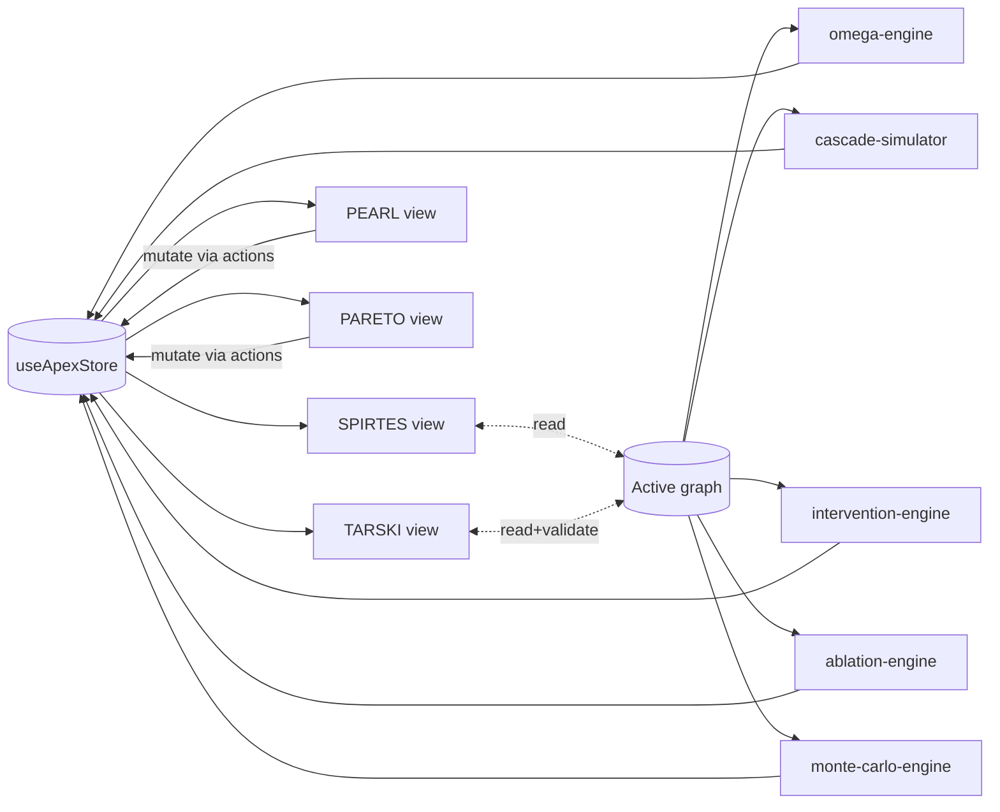

# Engines

> **Scope:** The analytical machinery that turns a static causal graph into interactive findings. Covers the four visible modules (**Spirtes**, **Tarski**, **Pearl**, **Pareto**) and the shared infrastructure they sit on: the **Omega engine**, the **cascade simulator**, the **intervention engine**, the **ablation engine**, the **Monte-Carlo forecast engine**, and the **copilot engine**.
> **Authoritative source:** `src/lib/omega-engine.ts`, `src/lib/cascade-simulator.ts`, `src/lib/intervention-engine.ts`, `src/lib/ablation-engine.ts`, `src/lib/monte-carlo-engine.ts`, `src/lib/copilot-engine.ts`, `src/lib/tarski-data.ts`.

Every engine in Manifold runs **in the browser**, synchronously, against whatever graph the analyst has loaded into the Zustand store. There is no remote compute step; the API route `src/app/api/compute/route.ts` exists for pieces of deterministic work that are easier to keep on the server (e.g. seeded backend runs for reproducibility), but the interactive loop is entirely client-side.

This has three practical consequences:

1. **Everything scales with graph size, not user count.** A slow screen is usually a large-graph screen.
2. **Reproducibility is trivial:** pure functions + seeded RNG + the exported JSON snapshot. Two analysts loading the same snapshot see identical results.
3. **There is no "engine daemon" to restart.** Bugs live in TS files; fixes ship via normal Vercel deploys.

---

## 1. The module layer — what the analyst sees

The HeaderBar exposes four module tabs:

| Tab | Icon | Purpose | Primary engine |
|---|---|---|---|
| **SPIRTES** | ◇ | Constraint-based causal discovery (PC / FCI / PCMCI+) and structural visualization. | Spirtes view reads the static graph + discoverySource sub-graphs; no simulation. |
| **TARSKI** | ⊢ | Logical entailment / consistency filter. Checks proposed edges and paths against an axiom library. | `tarski-data.ts` → `runTarskiValidation` |
| **PEARL** | ⟐ | Interventions and counterfactuals: do(X=x), edge severing, consequence spawning. | `intervention-engine.ts` + `cascade-simulator.ts` |
| **PARETO** | ⚠ | Multi-objective trade-off scans (e.g. Ω-composite vs restoration cost vs jurisdictional hazard). | Reuses cascade + Monte-Carlo engines under a multi-objective wrapper. |

Modules are a *view* onto shared state. Switching tabs does not discard any computation; it re-renders panels against the same store. This is intentional — an analyst can run a Pearl intervention, flip to Tarski to check whether the proposed sever violates an axiom, and flip back without losing work.



---

## 2. The Omega engine

`src/lib/omega-engine.ts` computes Manifold's top-line **Ω** state: a single fragility buffer, a derived "doomsday" projection, an alert level (GREEN/AMBER/RED), and a cascade stability snapshot.

### 2.1 Ω buffer and status

```ts
computeOmegaState(shocks: CausalShock[]): OmegaState
```

- `buffer = clamp(100 - totalSeverity·100, 0, 100)`. Shocks subtract from a normalized 0–100 buffer.
- Status thresholds:
  - `buffer ≥ 65` → `NOMINAL` (green)
  - `35 ≤ buffer < 65` → `ELEVATED` (amber)
  - `15 ≤ buffer < 35` → `CRITICAL` (red)
  - `buffer < 15` → `OMEGA_BREACH` (red)

The HeaderBar displays this via the `CDOmegaMonitor` component.

### 2.2 Doomsday state

```ts
computeDoomsdayState(shocks, buffer): DoomsdayState
```

- `fragilityIndex` = clamp(`totalSeverity·50 + (100 − buffer)·0.5`, 0, 100). A composite that reacts to *both* raw shock load and residual buffer.
- `timeToFailureDays` = max(3, round(365 · buffer/100)). Linear mapping from buffer to horizon.
- `regimeType` ∈ `{STABLE, STAGNATION, MELT_UP, PHASE_TRANSITION, CRASH}` keyed off `fragilityIndex` thresholds 20/40/60/80.
- **Dragon-king detection:** `fragilityIndex > 70` → `dragonKingDetected = true`; probability = clamp((fragilityIndex − 50)/50, 0, 1).
- **LPPLS parameters** (log-periodic power-law singularity): `lpplsOscFreq ≈ 6.36 + severity·2.1`, `lpplsTc ≈ timeToFailureDays + noise`, `singularityScore = fragilityIndex/100` once `> 60`.

These are heuristic approximations, not a fitted LPPLS. They are intended to give the operator a time-to-failure *cue*, not a statistical forecast. For the probabilistic forecast, use the Monte-Carlo engine (§6).

### 2.3 Alert level

```ts
computeAlertLevel(status, doomsday): 'GREEN' | 'AMBER' | 'RED'
```

- RED if `status ∈ {OMEGA_BREACH, CRITICAL}` **or** `timeToFailureDays < 30`.
- AMBER if `status = ELEVATED` **or** `fragilityIndex > 40`.
- Otherwise GREEN.

### 2.4 Cascade analysis

```ts
computeCascadeAnalysis(graph): CascadeAnalysis
```

Computes spectral-style stability indicators from the weighted adjacency:

- `lambdaMax` ≈ max weighted row sum of adjacency (cheap upper bound on the Perron eigenvalue).
- `isStable = lambdaMax < 1`.
- `dampingCoeff = 1 − lambdaMax` (when stable), else `0`.
- `forgettingRate = 0.05 + lambdaMax · 0.1`.
- `topCentralityNodes`: top 3 by degree centrality (normalized by max).

These constants are the defaults fed into the cascade simulator and the Monte-Carlo engine.

### 2.5 Preset shocks

`getPresetShocks()` returns a curated list used by the Shock Library panel:

1. **STRAIT OF HORMUZ CLOSURE** — severity 0.50, geopolitical.
2. **ABQAIQ PROCESSING ATTACK** — 0.45, energy.
3. **RAS LAFFAN LNG TRAIN OUTAGE** — 0.35, energy.
4. **UREA EXPORT RESTRICTION** — 0.30, supply.
5. **PHOSPHATE ORE CONTAMINATION** — 0.25, supply.
6. **MASTER GAS SYSTEM OVERLOAD** — 0.40, energy.
7. **GLOBAL FOOD PRICE SPIKE** — 0.35, geopolitical.

Each carries a `physicalConstraint` string that explains the bottleneck.

---

## 3. The cascade simulator

`src/lib/cascade-simulator.ts` is the discrete-time dynamical system that powers every "play the shock" replay in the UI.

### 3.1 Core loop

```ts
simulateCascade(graph, shocks, {maxEpochs, dampingFactor, forgettingRate, …})
  → { epochs: EpochSnapshot[], finalOmegaStatus, stabilityReached }
```

- **State per epoch** is a pair of `NodeEpochState` and `EdgeEpochState` records plus an aggregate Ω buffer and status.
- **Shocks → nodes** via `mapShocksToNodes(graph, shocks)`: each shock is distributed across matching `node.category` or nodes whose domain substring matches the category. The per-node intensity is capped at 1.0.
- **Adjacency** is built from non-severed edges, keyed by source.
- **Update rule** (conceptually): `next[target] = damping · (forgetting · prev[target] + Σ weight·prev[source])`, plus the per-node shock intensity applied at epoch 0 (and any edges that were severed mid-run).
- **Termination:** when the per-epoch delta drops below `stabilityThreshold` (`0.001`) or `maxEpochs` (`200`) is hit, whichever comes first.

Defaults (from `DEFAULT_CONFIG`):

```
maxEpochs:              200
dampingFactor:          0.85
forgettingRate:         0.05
stabilityThreshold:     0.001
criticalBufferThreshold: 15
omegaShockScale:        0.3
```

### 3.2 Replay buffers

The simulator writes two parallel traces:

- `baselineEpochs` — cascade run on the graph as loaded.
- `interventionEpochs` — cascade run on the intervention-modified graph (do(X), severed edges, spawned consequences).

The `activeTimeline` flag on the store decides which one the replay scrubber walks. Every `EpochSnapshot` records its Ω buffer and status, which is how the HeaderBar stays in sync with the replay position (see the `currentSnapshot` logic in `HeaderBar.tsx`).

### 3.3 Cascade → Omega coupling

When cascade simulation is active, the HeaderBar uses the current snapshot's `omegaBuffer` and `omegaStatus` in place of the shock-only `computeOmegaState` result. This is the coupling:

```
Shock list ──→ computeOmegaState ──→ baseline Ω
     │
     └──→ simulateCascade ──→ epoch[t].{omegaBuffer, omegaStatus} ──→ Ω during replay
```

---

## 4. The intervention engine (Pearl module)

`src/lib/intervention-engine.ts` implements the "apply an intervention and see what happens" loop. Two operations matter most:

### 4.1 `severEdgeAndSpawnConsequences`

Given an edge to cut and the graph:

1. Marks the edge as severed (`isSevered = true`) so the cascade simulator skips it.
2. Walks a `CONSEQUENCE_TEMPLATES` table keyed on high-level topic ("EUV Lithography", "Undersea Cables", "Rare Earth", "HVDC Power", "AI Compute", "Fertilizer", "Data Centers", "Dollar Funding", "Geopolitical", "Energy Grid") to decide which templated consequence nodes to spawn.
3. Adds the spawned consequence nodes to the graph with their own Omega fragility profiles and wires them in with new edges.
4. Returns the modified graph plus metadata the UI uses to animate the new nodes in.

Templated consequences give the analyst a fast "what spawns downstream of this cut?" loop without requiring them to author the follow-on nodes by hand. The fallback template (`DEFAULT_CONSEQUENCES`) spawns a generic *Emergent Disruption Risk* + *Cascade Amplification* pair when no domain-specific template matches.

### 4.2 do(X=x) application

do-calculus in Manifold is implemented as an edge rewrite: we sever all *inbound* edges to X (breaking the natural causes) and pin X's state to the target value for the duration of the cascade. The simulator sees the pinned value via the intervention-adjusted graph; there is no special "do" code path inside the simulator itself. This is the standard translation of do(X=x) into a mutilated graph, per Pearl.

### 4.3 Interaction with the store

`interventionPlan` on the store is a typed description of the analyst's intent (target node, severed edge ids, pinned values). When it changes, the store rebuilds the mutilated graph, re-runs `simulateCascade`, and writes `interventionEpochs`. The UI scrub bar then offers both the baseline and the intervention timelines.

---

## 5. The ablation engine

`src/lib/ablation-engine.ts` is the simpler sibling of the intervention engine: *remove* nodes or edges from the graph and report what changed structurally.

```ts
computeAblatedGraph(graph, ablatedNodeIds, ablatedEdgeIds): CausalGraph
computeAblationComparison(graph, ablatedNodeIds, ablatedEdgeIds): AblationComparison
```

`AblationMetrics` captures:

- `nodeCount`, `edgeCount`, `density = edges / (n·(n−1))`.
- `lambdaMax`, `isStable` (via `computeCascadeAnalysis`).
- `meanOmega`, `maxOmega` over remaining nodes.
- `affectedNodes` list and a 0–100 `structuralIntegrity` percentage.

`AblationComparison` returns the before/after pair plus deltas, including a `"STABLE→UNSTABLE"`-style stability transition string. This is what the Ablation panel renders as a "what did we lose" report.

> **Note on meaning:** ablation answers "how brittle is the system's *structure*", not "what happens dynamically". For dynamic answers, use the cascade simulator or the Monte-Carlo engine.

---

## 6. The Monte-Carlo forecast engine

`src/lib/monte-carlo-engine.ts` runs stochastic forecasts of the Ω buffer and of per-node Omega composites, comparing baseline vs. intervention worlds.

### 6.1 Types

```ts
interface MCConfig {
  numPaths: 200,
  horizonEpochs: 60,
  dampingFactor: 0.85,
  forgettingRate: 0.05,
  noiseScale: 0.12,
  omegaShockScale: 0.3,
}

interface MCPath {
  omegaBufferSeries: number[];      // per-epoch aggregate buffer
  targetOmegaSeries: number[];      // per-epoch intervention target
  downstreamSeries: Map<string, number[]>; // tracked downstream nodes
}

interface MCForecastResult {
  baselinePaths:    MCPath[];
  interventionPaths: MCPath[];
  baselineStats:     EpochStats[]; // {mean, p10,p25,p50,p75,p90}
  interventionStats: EpochStats[];
  trackedNodeIds: string[];
  horizonEpochs: number;
}
```

### 6.2 Randomness

- **RNG:** `mulberry32(seed)` — seeded 32-bit PRNG. The seed is either chosen by the analyst or derived from the intervention plan, so that the same plan always produces the same paths.
- **Noise model:** Box-Muller normal samples (`normalSample`) scaled by `noiseScale = 0.12` are added to each node's per-epoch update. This makes each path a slightly-perturbed trajectory around the deterministic cascade.
- **Shocks:** the baseline shock set is applied at epoch 0 to both baselines and interventions; the intervention applies its edge severs and do-pins before the first step.

### 6.3 Outputs

The UI renders the stats rather than the raw paths: `EpochStats` gives the p10/p25/p50/p75/p90 fan chart for each epoch, plus the mean. Analysts compare baseline vs intervention fans to see whether the intervention actually buys them buffer or just reshuffles risk.

---

## 7. The Tarski engine (Tarski module)

`src/lib/tarski-data.ts` exposes an `AXIOM_LIBRARY` and a `runTarskiValidation(graph)` routine.

- **Axioms** are tagged with a **level**:
  - `0` — *Physical laws* (conservation, Haber-Bosch stoichiometry, hydraulic limits, cryogenic lead-time floors).
  - `1` — *Regulatory / geopolitical* (export controls, cadmium thresholds, sanctions clauses).
  - `2` — *Heuristic* (observed historical patterns, correlational folklore).
- **Validation** checks each edge or path against applicable axioms and returns a `TarskiValidationReport` flagging any edge that is inconsistent with a level-0 or level-1 axiom. Inconsistent edges are marked so the visualization can draw them in the Tarski "inconsistency" style.

The copilot engine uses the same library: when the Copilot proposes an edge-sever or do-intervention, the Tarski report is consulted and conflicts are surfaced in the chat.

---

## 8. The Spirtes view

The Spirtes module has no dedicated TypeScript engine — it is a *view* that consumes the discovery-source sub-graphs already defined in the data layer:

- **DCD** (Differentiable Causal Discovery / NOTEARS-style): `ATHENA_DCD_NODES` / `ATHENA_DCD_EDGES`, and the analogous filter for the MAIN graph at display time.
- **PCMCI+**: nodes/edges with `lag > 0`.
- **FCI**: nodes with `isConfounded = true` or `discoverySource = 'FCI'`, and edges of type `confounded`.

The visualization toggles between these three sub-graphs so the analyst can see what each discovery procedure would have produced on the same variables. The "merged" status on a node means more than one procedure agreed.

The actual discovery *procedures* are not re-run in the browser; they are pre-computed offline and their results are what lives in `graph-data.ts`. If we re-run discovery (e.g. on a newly imported dataset), that happens in `src/app/api/compute/route.ts`.

---

## 9. The Pareto module

The Pareto view is a thin wrapper on top of the Monte-Carlo engine and the ablation engine. It runs many forecasts in parallel while varying a single lever (e.g. the severity of a chosen shock, or the set of severed edges), scores each point along multiple objectives (Ω-composite, restoration cost, jurisdictional hazard, cascade load), and draws the resulting frontier.

Per-point scoring is cheap: each point reuses `computeCascadeAnalysis` + a short Monte-Carlo burst. The UI plots the non-dominated set as the frontier and offers a click-through into the underlying scenario.

---

## 10. The copilot engine

`src/lib/copilot-engine.ts` is the *client-side* side of the copilot loop. It:

1. Accepts a natural-language user message plus the current graph context (serialized by `copilot-context.ts`).
2. Calls `POST /api/copilot` with the serialized context and the conversation history.
3. Parses the model's response, which is a mix of free-text explanation and structured `ACTION` commands.
4. Applies the ACTIONs against the store via typed dispatchers (`copilot-actions.ts`).

### 10.1 Action tags

The copilot emits structured actions as `<<<ACTION:type:param>>>` tags embedded in its text response. `copilot-actions.ts` parses them with a regex, strips them from the displayed text, and dispatches each against the store. The full set (see `executeAction` for the authoritative list):

| Tag | Param | Effect |
|---|---|---|
| `select_node` | node id or label | Focus a node in the inspector. |
| `add_shock` | shock id | Inject a preset shock from the library. |
| `remove_shock` | shock id | Remove an active shock. |
| `set_module` | `spirtes`/`tarski`/`pearl`/`pareto` | Switch the active module tab. |
| `set_view` | `2d`/`3d` | Switch visualization mode. |
| `sever_edge` | edge id | Pearl-style edge sever (used by cascade sim). |
| `reset_severed` | — | Clear all severed edges. |
| `start_replay` / `stop_replay` | — | Drive the cascade replay scrubber. |
| `set_truth_filter` | `raw`/`verified` | Toggle Tarski verification filter. |
| `set_domains` / `select_domains` | comma-separated domain ids | Rebuild the graph from a subset of domain cards. |
| `solve_interdiction` | `budget=N,mode=edge\|node\|both` | Run the minimax interdiction solver (or fall back to structural vulnerability if cascade delta is too small); auto-switches to PEARL. |
| `apply_interdiction` | `1,3` or `all` | Apply specific cuts from the most recent `solve_interdiction` result. |

Every action is explicit in the transcript and replayable: re-running the same transcript against the same graph produces the same state transitions. Cascade, Monte-Carlo, and Tarski validation runs are not directly triggerable by the copilot — they are side effects of state changes (e.g. adding a shock) and of explicit UI buttons.

### 10.2 Axiom integration

The copilot reads from `AXIOM_LIBRARY` (in `tarski-data.ts`) when composing its context. Proposed severs and do-interventions are described in the chat narrative alongside the relevant axiom id(s) (e.g. `LAW:HABER_BOSCH`, `REG:EU_CADMIUM`); there is no separate "validate" action — the Tarski filter is a UI toggle on the Tarski module view.

### 10.3 The server half

`src/app/api/copilot/route.ts` is a stateless Node runtime route that fans out to the configured LLM provider (see `src/lib/llm-providers.ts`) and returns the structured response. It is provider-agnostic — swapping Anthropic for Gemini is a config change, not a code change.

---

## 11. Putting it together — a typical analyst session

```mermaid
sequenceDiagram
  participant U as Analyst
  participant UI as React UI
  participant S as Store
  participant OE as omega-engine
  participant CS as cascade-simulator
  participant IE as intervention-engine
  participant MC as monte-carlo-engine
  participant CP as copilot-engine

  U->>UI: select domains (energy + infra)
  UI->>S: setSelectedDomains(...)
  S->>S: buildGraphFromDomains → activeGraph
  S->>OE: computeCascadeAnalysis
  S->>UI: render SPIRTES view

  U->>UI: apply ABQAIQ shock
  UI->>S: addShock(...)
  S->>OE: computeOmegaState + computeDoomsdayState
  S->>CS: simulateCascade → baselineEpochs
  S->>UI: HeaderBar buffer drops; replay available

  U->>UI: switch to PEARL; sever pipeline edge
  UI->>IE: severEdgeAndSpawnConsequences
  IE->>S: add consequence nodes, mark severed
  S->>CS: simulateCascade → interventionEpochs
  S->>UI: timeline toggle + scrubber

  U->>UI: "forecast the next 60 epochs" (chat)
  UI->>CP: user message
  CP->>CP: serialize graph context
  CP->>Server: POST /api/copilot
  Server-->>CP: text + ACTIONs
  CP->>S: RUN_MONTE_CARLO action
  S->>MC: runMonteCarloForecast
  MC-->>S: baselineStats + interventionStats
  S->>UI: fan chart rendered
```

---

## 12. Practical notes for engine work

- **Pure functions only.** Every engine exports pure functions that take a graph and options and return a new result. Side effects live in the Zustand actions.
- **Seeded RNG everywhere.** Monte-Carlo paths, consequence ids, and any randomness inside tests must use the `mulberry32` seed pattern. Never call `Math.random()` inside an engine. (There is one intentional exception in `computeDoomsdayState` for cosmetic LPPLS noise.)
- **No `await`.** The engines are synchronous; the only asynchronous boundary is the copilot route.
- **Respect the graph invariants.** Never mutate a graph in place. Use `mergeGraphs` / `computeAblatedGraph` / `severEdgeAndSpawnConsequences` to produce a new object.
- **Tests live in `src/lib/__tests__/`.** The `prebuild` script runs `vitest run` before every build; a failing test blocks deploys.

For the deploy story (how these engines get to production, how env vars flow, how to recover from a bad ship), see [`DEPLOYMENT.md`](./DEPLOYMENT.md).
