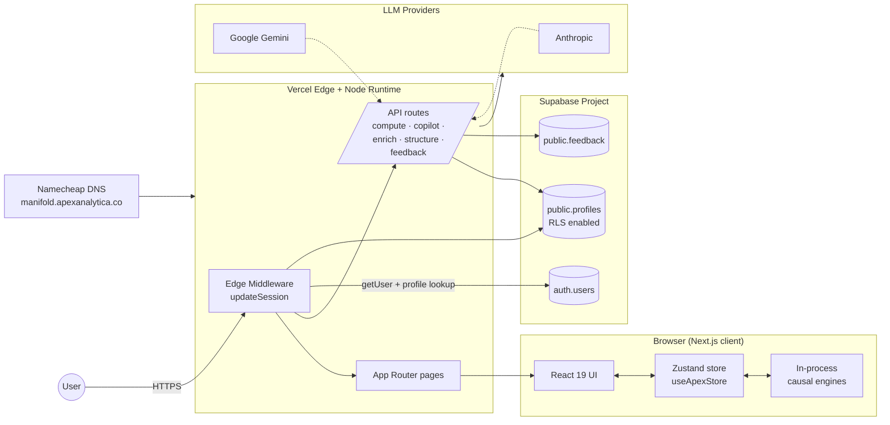

# Manifold — Internal Platform Documentation

> **Audience:** Apex Analytica engineers, operations, and select external reviewers (e.g. due-diligence under NDA).
> **Status:** Living document. Last refreshed 2026-04-10.

Manifold (the product, formerly *APEX Terminal*) is a causal-derivation workbench for systemic-risk analysis. It blends an Edge-deployed Next.js front end, a Supabase/Postgres identity and storage layer, an in-process causal-inference engine suite, and a configurable set of LLM providers used for enrichment, copilot, and structuring tasks.

This `docs/` folder is the canonical reference for how those pieces fit together. It is intentionally narrative — diagrams first, code links second — so that a new engineer or a non-technical reviewer can build a mental model in roughly an hour.

---

## Document map

| File | What it covers | Read first if… |
|---|---|---|
| [`ARCHITECTURE.md`](./ARCHITECTURE.md) | Top-down system topology, request flow, runtime components, hosting model. | You want the 30-minute overview. |
| [`AUTH.md`](./AUTH.md) | Supabase auth, `profiles` table, RLS, trial vs trusted access, middleware logic, admin runbook. | You are onboarding a user, debugging a redirect loop, or rotating keys. |
| [`DATA_MODEL.md`](./DATA_MODEL.md) | The causal graphs (`MAIN_GRAPH`, `ATHENA_GRAPH`, `BRIDGE_EDGES`), domain selector, in-memory store. | You are adding a new domain, node, or cross-domain edge. |
| [`ENGINES.md`](./ENGINES.md) | The four causal-inference modules (Spirtes, Tarski, Pearl, Pareto) plus the Omega, Cascade, Intervention, Ablation, and Monte-Carlo engines. | You are touching simulation, scoring, or interpretation logic. |
| [`DEPLOYMENT.md`](./DEPLOYMENT.md) | Vercel project, custom domain, environment variables, CLI deploy + alias pattern, runbook for common failures. | You are shipping a release or recovering from an incident. |

The legacy `.docx` files in this folder (`apex-terminal-spirtes-engine.docx`, `apex-terminal-system-architecture.docx`, `apex-terminal-tarski-engine.docx`) are kept for historical reference only and are superseded by the markdown files above.

---

## One-paragraph product summary

Manifold ingests heterogeneous time-series and structural metadata (CSV, XLSX, PDF), maps them onto a curated causal graph spanning ~8 economic and security domains, and lets an analyst (1) discover causal structure with constraint-based and score-based search, (2) test logical entailment with a Tarski truth-filter, (3) simulate `do(·)` interventions and counterfactuals à la Pearl, and (4) run Pareto-style multi-objective trade-off scans. A persistent **Omega Fragility (Ω)** state tracks five pillars (Information, Resources, Justice, Capital, Truth) so that each shock or intervention is interpretable as a movement of the system toward or away from collapse. A natural-language Copilot can plan and execute graph operations on the analyst's behalf.

---

## High-level system diagram



A more detailed flow (request lifecycle, data lifecycle, deploy lifecycle) lives in [`ARCHITECTURE.md`](./ARCHITECTURE.md).

---

## Repository orientation (for newcomers)

```
apex-terminal/
├── src/
│   ├── app/                 # Next.js App Router (pages + API routes)
│   │   ├── (dashboard)/...  # Authenticated workspace
│   │   ├── login/           # Sign-in page
│   │   ├── trial-signup/    # 48-hour trial signup
│   │   ├── expired/         # Trial-expired wall
│   │   └── api/             # compute · copilot · enrich · feedback · structure
│   ├── components/          # ~30 React components (HeaderBar, DomainSelector, …)
│   ├── lib/
│   │   ├── supabase/        # client / server / middleware adapters
│   │   ├── graph-data.ts          # MAIN_GRAPH (142 nodes, 262 edges)
│   │   ├── athena-graph-data.ts   # ATHENA_GRAPH + BRIDGE_EDGES
│   │   ├── omega-engine.ts        # Ω fragility scoring
│   │   ├── cascade-simulator.ts   # shock propagation
│   │   ├── intervention-engine.ts # do-calculus
│   │   ├── ablation-engine.ts     # edge ablation comparison
│   │   ├── monte-carlo-engine.ts  # forecast paths
│   │   ├── copilot-engine.ts      # NL → ACTION translation
│   │   └── …                      # additional engines & helpers
│   ├── stores/useApexStore.ts     # Zustand store (~800 lines, ~200 actions)
│   └── middleware.ts              # Edge entry → updateSession
├── docs/                          # ← you are here
├── supabase-setup.sql             # Idempotent schema bootstrap
├── public/                        # Static assets (logo, fonts, icons)
└── package.json                   # Next 16, React 19, Supabase SSR, Zustand
```

For module-level deep dives, follow the cross-references in each sub-doc.

---

## Conventions used in this folder

- **Mermaid** for diagrams. Anything GitHub renders we keep here; anything else lives outside the repo.
- **Code links** are relative paths (`src/lib/omega-engine.ts`) so that they work both on disk and in GitHub.
- **Cite-by-line** is intentionally avoided — line numbers drift. We cite by exported symbol or section heading.
- **Imperative voice** for runbooks (`Run …`, `Verify …`); descriptive voice for architecture.

---

## Who to ask

- **Architecture, engines, store:** engineering lead.
- **Supabase, identity, billing posture:** platform/ops.
- **Domain semantics (which nodes go in which graph):** domain SMEs in the `project_team.md` memory note.
- **Anything time-sensitive (incident, customer escalation):** see the runbook in [`DEPLOYMENT.md`](./DEPLOYMENT.md#runbook).
